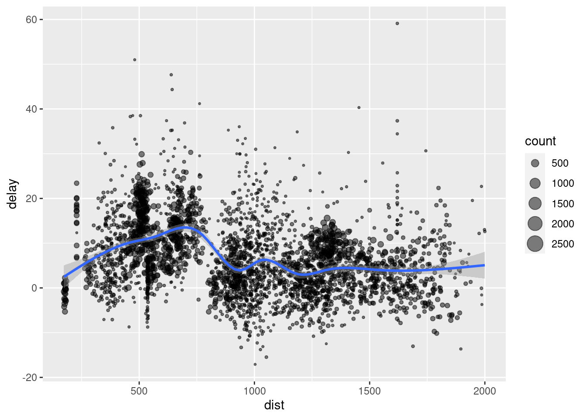

# Working with tables

The main library we'll use is dplyr. We are also using readr for reading files onto R.


```r
library(dplyr)
library(readr)
```

## Creating and selecting columns

### mtcars dataset

Let us begin creating columns or redefining existing ones. For this, we use the `mutate()` function. It receives a data frame or tibble (mainly via the _pipe_ operator, `%>%`) and performs a formula for calculating new or existing columns. 

We read the data with the `read_csv()` function from the `readr` package. 


```r
df_mtcars <- read_csv("data/mtcars.csv")
```

```
## 
## ── Column specification ────────────────────────────────────────────────────────
## cols(
##   mpg = col_double(),
##   cyl = col_double(),
##   disp = col_double(),
##   hp = col_double(),
##   drat = col_double(),
##   wt = col_double(),
##   qsec = col_double(),
##   vs = col_double(),
##   am = col_double(),
##   gear = col_double(),
##   carb = col_double()
## )
```

The data has been obtained from R base and you can read the documentation with `? mtcars`.

`read_csv()` gives us some information about the reading. We can see that all columns belong to class `numeric`. We can have a more detailed look at the tibble with `glimpse()`, which shows us the first rows and some info.


```r
df_mtcars %>% glimpse()
```

```
## Rows: 32
## Columns: 11
## $ mpg  <dbl> 21.0, 21.0, 22.8, 21.4, 18.7, 18.1, 14.3, 24.4, 22.8, 19.2, 17.8,…
## $ cyl  <dbl> 6, 6, 4, 6, 8, 6, 8, 4, 4, 6, 6, 8, 8, 8, 8, 8, 8, 4, 4, 4, 4, 8,…
## $ disp <dbl> 160.0, 160.0, 108.0, 258.0, 360.0, 225.0, 360.0, 146.7, 140.8, 16…
## $ hp   <dbl> 110, 110, 93, 110, 175, 105, 245, 62, 95, 123, 123, 180, 180, 180…
## $ drat <dbl> 3.90, 3.90, 3.85, 3.08, 3.15, 2.76, 3.21, 3.69, 3.92, 3.92, 3.92,…
## $ wt   <dbl> 2.620, 2.875, 2.320, 3.215, 3.440, 3.460, 3.570, 3.190, 3.150, 3.…
## $ qsec <dbl> 16.46, 17.02, 18.61, 19.44, 17.02, 20.22, 15.84, 20.00, 22.90, 18…
## $ vs   <dbl> 0, 0, 1, 1, 0, 1, 0, 1, 1, 1, 1, 0, 0, 0, 0, 0, 0, 1, 1, 1, 1, 0,…
## $ am   <dbl> 1, 1, 1, 0, 0, 0, 0, 0, 0, 0, 0, 0, 0, 0, 0, 0, 0, 1, 1, 1, 0, 0,…
## $ gear <dbl> 4, 4, 4, 3, 3, 3, 3, 4, 4, 4, 4, 3, 3, 3, 3, 3, 3, 4, 4, 4, 3, 3,…
## $ carb <dbl> 4, 4, 1, 1, 2, 1, 4, 2, 2, 4, 4, 3, 3, 3, 4, 4, 4, 1, 2, 1, 1, 2,…
```

**Exercise.** What are the differences between `glimpse(df_mtcars)` and `df_mtcars %>% glimpse()`? 

With the first rows we can confirm that all the columns are numerical but we can detect some differences among them. For instance, `cyl` and the last ones are integer numbers, so they can represent countings, or even categories, since values at `vs` or `am` seem only 0 and 1. 

We can have more numerical information with `summary()`, from R base.


```r
summary(df_mtcars)
```

```
##       mpg             cyl             disp             hp       
##  Min.   :10.40   Min.   :4.000   Min.   : 71.1   Min.   : 52.0  
##  1st Qu.:15.43   1st Qu.:4.000   1st Qu.:120.8   1st Qu.: 96.5  
##  Median :19.20   Median :6.000   Median :196.3   Median :123.0  
##  Mean   :20.09   Mean   :6.188   Mean   :230.7   Mean   :146.7  
##  3rd Qu.:22.80   3rd Qu.:8.000   3rd Qu.:326.0   3rd Qu.:180.0  
##  Max.   :33.90   Max.   :8.000   Max.   :472.0   Max.   :335.0  
##       drat             wt             qsec             vs        
##  Min.   :2.760   Min.   :1.513   Min.   :14.50   Min.   :0.0000  
##  1st Qu.:3.080   1st Qu.:2.581   1st Qu.:16.89   1st Qu.:0.0000  
##  Median :3.695   Median :3.325   Median :17.71   Median :0.0000  
##  Mean   :3.597   Mean   :3.217   Mean   :17.85   Mean   :0.4375  
##  3rd Qu.:3.920   3rd Qu.:3.610   3rd Qu.:18.90   3rd Qu.:1.0000  
##  Max.   :4.930   Max.   :5.424   Max.   :22.90   Max.   :1.0000  
##        am              gear            carb      
##  Min.   :0.0000   Min.   :3.000   Min.   :1.000  
##  1st Qu.:0.0000   1st Qu.:3.000   1st Qu.:2.000  
##  Median :0.0000   Median :4.000   Median :2.000  
##  Mean   :0.4062   Mean   :3.688   Mean   :2.812  
##  3rd Qu.:1.0000   3rd Qu.:4.000   3rd Qu.:4.000  
##  Max.   :1.0000   Max.   :5.000   Max.   :8.000
```

For calculating new or existing rows we use `mutate()`, as mentiobed before. If we only use `mutate()`, R shows us the data frame with the new calculations on the console, but does not overwrite it. We need to assing the result to the data frame to overwrite the result.

For intance, the weight is given in 1000 lbs. Let's change the units.

First, we can have a look at the first rows of this column with the function `select()`.


```r
df_mtcars %>% 
  select(wt)
```

```
## # A tibble: 32 x 1
##       wt
##    <dbl>
##  1  2.62
##  2  2.88
##  3  2.32
##  4  3.22
##  5  3.44
##  6  3.46
##  7  3.57
##  8  3.19
##  9  3.15
## 10  3.44
## # … with 22 more rows
```

Now let's make the calculation.


```r
df_mtcars %>% 
  mutate(wt = wt * 1000)
```

```
## # A tibble: 32 x 11
##      mpg   cyl  disp    hp  drat    wt  qsec    vs    am  gear  carb
##    <dbl> <dbl> <dbl> <dbl> <dbl> <dbl> <dbl> <dbl> <dbl> <dbl> <dbl>
##  1  21       6  160    110  3.9   2620  16.5     0     1     4     4
##  2  21       6  160    110  3.9   2875  17.0     0     1     4     4
##  3  22.8     4  108     93  3.85  2320  18.6     1     1     4     1
##  4  21.4     6  258    110  3.08  3215  19.4     1     0     3     1
##  5  18.7     8  360    175  3.15  3440  17.0     0     0     3     2
##  6  18.1     6  225    105  2.76  3460  20.2     1     0     3     1
##  7  14.3     8  360    245  3.21  3570  15.8     0     0     3     4
##  8  24.4     4  147.    62  3.69  3190  20       1     0     4     2
##  9  22.8     4  141.    95  3.92  3150  22.9     1     0     4     2
## 10  19.2     6  168.   123  3.92  3440  18.3     1     0     4     4
## # … with 22 more rows
```

If there are too many columns is uncomfortable seeing the results. We can use `select()` and make the pipeline longer.


```r
df_mtcars %>% 
  mutate(wt = wt * 1000) %>% 
  select(wt)
```

```
## # A tibble: 32 x 1
##       wt
##    <dbl>
##  1  2620
##  2  2875
##  3  2320
##  4  3215
##  5  3440
##  6  3460
##  7  3570
##  8  3190
##  9  3150
## 10  3440
## # … with 22 more rows
```

The calculation seems correct. Now, instead of showing the result on the console, we overwrite the result (we don't use `select()` now because we want the entire tibble).


```r
df_mtcars <- df_mtcars %>% 
  mutate(wt = wt * 1000)
```

We don't see anything on the screen but R has changed the column `wt`. Had we made a mistake and wanted to go back, we would have to execute again the reading of the file or make the opposite calculation. 


```r
df_mtcars %>% 
  mutate(wt = wt / 1000) %>% 
  select(wt)
```

```
## # A tibble: 32 x 1
##       wt
##    <dbl>
##  1  2.62
##  2  2.88
##  3  2.32
##  4  3.22
##  5  3.44
##  6  3.46
##  7  3.57
##  8  3.19
##  9  3.15
## 10  3.44
## # … with 22 more rows
```

The documentation explains that `vs` represents the shape of the engine. It is 0 or 1. Imagine you don't like this numbers and you want to use 1 and 2. You can easily add 1 to the column.


```r
mtcars %>% 
  mutate(vs = vs + 1) %>% 
  select(vs)
```

```
##                     vs
## Mazda RX4            1
## Mazda RX4 Wag        1
## Datsun 710           2
## Hornet 4 Drive       2
## Hornet Sportabout    1
## Valiant              2
## Duster 360           1
## Merc 240D            2
## Merc 230             2
## Merc 280             2
## Merc 280C            2
## Merc 450SE           1
## Merc 450SL           1
## Merc 450SLC          1
## Cadillac Fleetwood   1
## Lincoln Continental  1
## Chrysler Imperial    1
## Fiat 128             2
## Honda Civic          2
## Toyota Corolla       2
## Toyota Corona        2
## Dodge Challenger     1
## AMC Javelin          1
## Camaro Z28           1
## Pontiac Firebird     1
## Fiat X1-9            2
## Porsche 914-2        1
## Lotus Europa         2
## Ford Pantera L       1
## Ferrari Dino         1
## Maserati Bora        1
## Volvo 142E           2
```

**Remark.** Remember to assign the result to the tibble with ` <- ` if you want to keep the results. Don't forget to erase `select()` in this case.

This change on the column may not seem very useful. It can be more interesting changing the numbers with the real meaning: V-shaped and straight. For this, we need the column to be a character, but it is numeric.


```r
class(df_mtcars$vs)
```

```
## [1] "numeric"
```

We want to assign these meaning to the numbers and, therefore, the column will be a character, but R will take care of this for us. For changing the values, we use `if_else()`. We want to say: 'if vs equals 0, then it will equal "V-shaped", else "straight"'. We can create and auxiliar column `vs_aux` for making the change more clear.


```r
df_mtcars %>% 
  mutate(vs_aux = if_else(vs == 0, "V-shaped", "straight")) %>% 
  select(vs, vs_aux)
```

```
## # A tibble: 32 x 2
##       vs vs_aux  
##    <dbl> <chr>   
##  1     0 V-shaped
##  2     0 V-shaped
##  3     1 straight
##  4     1 straight
##  5     0 V-shaped
##  6     1 straight
##  7     0 V-shaped
##  8     1 straight
##  9     1 straight
## 10     1 straight
## # … with 22 more rows
```

**Remark.** Choose whatever names you want for the columns: it is not necessary to call the auxiliar one `vs_aux`. And you can overwrite the tibble or not: you are programming, you can always run everything again! =D

The idea of keeping the numbers instead of the character column is that numbers require less space on your computer's memory. So storing the shape with a numerical code is more efficient. In fact, you have already checked that the column is numerical but it would be better if it were integer.

**Exercise.** Decide what columns can be stored as integer without losing information and change them. For changing the type of an object or vector you can use `as.integer()`. For instance:


```r
class(c(4, 6, 1))
```

```
## [1] "numeric"
```

```r
class(as.integer(4, 6, 1))
```

```
## [1] "integer"
```


```r
df_mtcars %>% 
  mutate(
    cyl = as.integer(cyl), 
    vs = as.integer(vs), 
    am = as.integer(am), 
    gear = as.integer(gear), 
    carb = as.integer(carb)
  )
```

```
## # A tibble: 32 x 11
##      mpg   cyl  disp    hp  drat    wt  qsec    vs    am  gear  carb
##    <dbl> <int> <dbl> <dbl> <dbl> <dbl> <dbl> <int> <int> <int> <int>
##  1  21       6  160    110  3.9   2620  16.5     0     1     4     4
##  2  21       6  160    110  3.9   2875  17.0     0     1     4     4
##  3  22.8     4  108     93  3.85  2320  18.6     1     1     4     1
##  4  21.4     6  258    110  3.08  3215  19.4     1     0     3     1
##  5  18.7     8  360    175  3.15  3440  17.0     0     0     3     2
##  6  18.1     6  225    105  2.76  3460  20.2     1     0     3     1
##  7  14.3     8  360    245  3.21  3570  15.8     0     0     3     4
##  8  24.4     4  147.    62  3.69  3190  20       1     0     4     2
##  9  22.8     4  141.    95  3.92  3150  22.9     1     0     4     2
## 10  19.2     6  168.   123  3.92  3440  18.3     1     0     4     4
## # … with 22 more rows
```


### Invented dataset

#### Why this is useful

Being able to simulate some random data is useful when you are developing some code but you haven't receive the final data yet. Nonetheless, because of the project's timing, you need to keep on working so that you'll have some code already prepared when you're data arrives and you don't need to begin from scratch by then. 

#### Simulating data

This branch of Statistics takes several months at University to studying it. But for our purpose we just need some basics concepts. 

<!-- **Question.** Have you already seen `ALEATORIO()` function in Excel? -->

Imaging you are betting on something and you need a coin. You can use a calculator or R to simulate the results. There is always some function that allows you to get a _random_ number between 0 and 1 (I emphasized _random_ because it requires some time to explain what that means, since nothing is random but controlled by the laws of physics, except maybe the location of an electron). Mathematically, you can use to simulate the results of a coin flip.


```r
runif(10)
```

```
##  [1] 0.958580708 0.175003523 0.465296328 0.431838779 0.524756400 0.001363652
##  [7] 0.380046801 0.690146959 0.665239784 0.991097702
```

If you run that on your computer, you're results will be different (because they are random). Long story short, we can get the same numbers if we fix one thing called seed:


```r
set.seed(1234)
runif(10)
```

```
##  [1] 0.113703411 0.622299405 0.609274733 0.623379442 0.860915384 0.640310605
##  [7] 0.009495756 0.232550506 0.666083758 0.514251141
```

Now you can say that lower than 0.5 results will represent tails and the rest, heads:


```r
set.seed(1234)
results <- runif(10)

library(dplyr)
if_else(results < 0.5, "tails", "heads")
```

```
##  [1] "tails" "heads" "heads" "heads" "heads" "heads" "tails" "tails" "heads"
## [10] "heads"
```

#### Creating a data frame

You should know that what we have just created is a vector. And vectors can be used as columns on a data frame or tibble. Therefore, we'll invent some data following this methodology and take advantage of the data for some calculations. 

Imagine we have 20 stores, with two dimensions, length and width, the number of customers we receive per day, the daily income and the colors of the walls (between green, red, blue and white (yes, wonderful colors for walls)). Let's simulate this.

For creating a tibble we use the function `tibble()`, from the tibble package but available on dplyr. Inside the function we will introduce the vectors with the simulations and the names of the columns. First, the vectors.


```r
number_of_stores <- 20

indices <- 1:number_of_stores # Index: 1, 2, 3, 4, ..., 20

# For the random data we can do the seed thing so that the results will be the same
# for all of us
set.seed(2718)

length_sim <- rnorm(number_of_stores, mean = 7, sd = 1.5)
width_sim <- rnorm(number_of_stores, mean = 10, sd = 2.1)

# For the customers, we assume that the average will be 50. 
# You'll learn what a Poisson distribution is later on
customers_daily <- rpois(number_of_stores, lambda = 50)

income_daily <- rnorm(number_of_stores, mean = 2000, sd = 100)

colors <- sample(c("green", "blue", "red", "white"), 
                 size = number_of_stores, replace = TRUE)


df_inventado <- tibble(
  ind = indices, 
  long = length_sim, 
  ancho = width_sim, 
  clientes = customers_daily, 
  euros = income_daily, 
  col = colors
)
```


```r
glimpse(df_inventado)
```

```
## Rows: 20
## Columns: 6
## $ ind      <int> 1, 2, 3, 4, 5, 6, 7, 8, 9, 10, 11, 12, 13, 14, 15, 16, 17, 18…
## $ long     <dbl> 7.727768, 5.241214, 8.033535, 6.067075, 5.908894, 6.080340, 8…
## $ ancho    <dbl> 12.958071, 10.644176, 10.474705, 7.838526, 11.020973, 9.76414…
## $ clientes <int> 50, 38, 52, 42, 58, 47, 45, 39, 42, 49, 57, 59, 46, 57, 47, 4…
## $ euros    <dbl> 2016.820, 1979.281, 1771.956, 2158.435, 1951.960, 1988.361, 2…
## $ col      <chr> "white", "blue", "white", "blue", "blue", "green", "green", "…
```

**Exercises.** Now you make some calculations. You will need `mutate()`. Remember what has already been explained above. You can decide when to overwrite the data frame with the new calculations or just print them on the console.

1. Compute the total area of each store.

2. Calculate how many euros each customer spends, per store.

3. Calculate how many euros each customer spends on average, in total. _Hint._ For doing this, `summarise()` is very useful and you can read the documentation for learning how to use it. However, you can also use an approach with vectors using `$` and the functions `sum()` or `mean()`.

4. If the store is white or blue, reduce its length in 5 meters; else, increase it 10 meters. _Hint._ `? if_else()`. You should also write the condition with `%in%`. For learning how to do this, play in the console with `"white" %in% c("white", "blue")` or `"red" %in% c("white", "blue")` and try to understand what's happening and how you can use it inside `mutate()`.

5. If all the customers in a day went to the store at the same time, how many squared meters per customer would there be in each store?

**Solutions.**


```r
# Exercise 1
df_inventado %>% 
  mutate(area = ancho * long)

# Exercise 2
df_inventado %>% 
  mutate(euros / clientes)

# Exercise 3
df_inventado %>% 
  summarise(sum(euros) / sum(clientes))

sum(df_inventado$euros) / sum(df_inventado$clientes)


# Exercise 4
df_inventado %>% 
  mutate(nueva_long = if_else(col %in%  c("white", "blue"), long - 5, long + 10)) %>% 
  select(nueva_long, long)

# Exercise 5
df_inventado %>% 
  mutate(area = long * ancho, sqm_per_cust = area / clientes) %>% 
  select(clientes, area, sqm_per_cust)
```

## Filtering rows

You may know how to apply filters in Excel. In R you can do this too. The goal is to access the rows of a data frame that fulfill certain conditions. We'll work with an example. 

**If you have already run `library(dplyr)`**, you will be able to use the `starwars` data frame. You can have a look a it with `glimpse()` (as you should know by now). 


```r
glimpse(starwars)
```

```
## Rows: 87
## Columns: 14
## $ name       <chr> "Luke Skywalker", "C-3PO", "R2-D2", "Darth Vader", "Leia Or…
## $ height     <int> 172, 167, 96, 202, 150, 178, 165, 97, 183, 182, 188, 180, 2…
## $ mass       <dbl> 77.0, 75.0, 32.0, 136.0, 49.0, 120.0, 75.0, 32.0, 84.0, 77.…
## $ hair_color <chr> "blond", NA, NA, "none", "brown", "brown, grey", "brown", N…
## $ skin_color <chr> "fair", "gold", "white, blue", "white", "light", "light", "…
## $ eye_color  <chr> "blue", "yellow", "red", "yellow", "brown", "blue", "blue",…
## $ birth_year <dbl> 19.0, 112.0, 33.0, 41.9, 19.0, 52.0, 47.0, NA, 24.0, 57.0, …
## $ sex        <chr> "male", "none", "none", "male", "female", "male", "female",…
## $ gender     <chr> "masculine", "masculine", "masculine", "masculine", "femini…
## $ homeworld  <chr> "Tatooine", "Tatooine", "Naboo", "Tatooine", "Alderaan", "T…
## $ species    <chr> "Human", "Droid", "Droid", "Human", "Human", "Human", "Huma…
## $ films      <list> <"The Empire Strikes Back", "Revenge of the Sith", "Return…
## $ vehicles   <list> <"Snowspeeder", "Imperial Speeder Bike">, <>, <>, <>, "Imp…
## $ starships  <list> <"X-wing", "Imperial shuttle">, <>, <>, "TIE Advanced x1",…
```

**Exercise.**

- What are the names of the columns?
- What are the classes of each column?
- What are the dimensions of the data frame (number of rows and columns)?

**Remark.** Remember to use `? starwars` to access the documentation. 

We can set a condition a take only the rows under this condition. For instance, we want all the character taller than 175cms. You may remember from vector that you can do create a logical vector with this condition doing something like this: 


```r
starwars$height > 175
```

```
##  [1] FALSE FALSE FALSE  TRUE FALSE  TRUE FALSE FALSE  TRUE  TRUE  TRUE  TRUE
## [13]  TRUE  TRUE FALSE FALSE FALSE  TRUE FALSE FALSE  TRUE  TRUE  TRUE  TRUE
## [25] FALSE  TRUE FALSE    NA FALSE FALSE  TRUE  TRUE FALSE  TRUE  TRUE  TRUE
## [37]  TRUE FALSE FALSE  TRUE FALSE FALSE  TRUE  TRUE FALSE FALSE FALSE  TRUE
## [49]  TRUE  TRUE FALSE  TRUE  TRUE  TRUE  TRUE  TRUE  TRUE FALSE  TRUE  TRUE
## [61] FALSE FALSE FALSE  TRUE  TRUE  TRUE FALSE  TRUE  TRUE  TRUE FALSE FALSE
## [73] FALSE  TRUE  TRUE  TRUE  TRUE  TRUE  TRUE  TRUE  TRUE    NA    NA    NA
## [85]    NA    NA FALSE
```

Now we could see the names of the characters whose associated value in this vector is `TRUE`. The names of the characters are stored on the first column, `name`.


```r
starwars$name[starwars$height > 175]
```

```
##  [1] "Darth Vader"         "Owen Lars"           "Biggs Darklighter"  
##  [4] "Obi-Wan Kenobi"      "Anakin Skywalker"    "Wilhuff Tarkin"     
##  [7] "Chewbacca"           "Han Solo"            "Jek Tono Porkins"   
## [10] "Boba Fett"           "IG-88"               "Bossk"              
## [13] "Lando Calrissian"    "Ackbar"              NA                   
## [16] "Qui-Gon Jinn"        "Nute Gunray"         "Jar Jar Binks"      
## [19] "Roos Tarpals"        "Rugor Nass"          "Ric Olié"           
## [22] "Quarsh Panaka"       "Bib Fortuna"         "Ayla Secura"        
## [25] "Mace Windu"          "Ki-Adi-Mundi"        "Kit Fisto"          
## [28] "Adi Gallia"          "Saesee Tiin"         "Yarael Poof"        
## [31] "Plo Koon"            "Mas Amedda"          "Gregar Typho"       
## [34] "Cliegg Lars"         "Poggle the Lesser"   "Dooku"              
## [37] "Bail Prestor Organa" "Jango Fett"          "Dexter Jettster"    
## [40] "Lama Su"             "Taun We"             "Wat Tambor"         
## [43] "San Hill"            "Shaak Ti"            "Grievous"           
## [46] "Tarfful"             "Raymus Antilles"     "Sly Moore"          
## [49] "Tion Medon"          NA                    NA                   
## [52] NA                    NA                    NA
```

Yes, there are some `NA` things. We'll talk about than in a few minutes.

Working with vector is efficient but the sintax is verbose. dplyr provide us with a different sintax, data frame - orientated (remember that when doing statistics, data will be mainly stored in tables, therefore we love data frames and working with them <3).

Let's see how to do this with data frames. 


```r
starwars %>% 
  filter(height > 175)
```

```
## # A tibble: 48 x 14
##    name    height  mass hair_color  skin_color eye_color birth_year sex   gender
##    <chr>    <int> <dbl> <chr>       <chr>      <chr>          <dbl> <chr> <chr> 
##  1 Darth …    202 136   none        white      yellow          41.9 male  mascu…
##  2 Owen L…    178 120   brown, grey light      blue            52   male  mascu…
##  3 Biggs …    183  84   black       light      brown           24   male  mascu…
##  4 Obi-Wa…    182  77   auburn, wh… fair       blue-gray       57   male  mascu…
##  5 Anakin…    188  84   blond       fair       blue            41.9 male  mascu…
##  6 Wilhuf…    180  NA   auburn, gr… fair       blue            64   male  mascu…
##  7 Chewba…    228 112   brown       unknown    blue           200   male  mascu…
##  8 Han So…    180  80   brown       fair       brown           29   male  mascu…
##  9 Jek To…    180 110   brown       fair       blue            NA   male  mascu…
## 10 Boba F…    183  78.2 black       fair       brown           31.5 male  mascu…
## # … with 38 more rows, and 5 more variables: homeworld <chr>, species <chr>,
## #   films <list>, vehicles <list>, starships <list>
```

Doing this we keep all the information about the characters: we have only removed the rows about characters we're not interested on because of their height.

We can also extend the pipeline and also select only the column of names. 


```r
starwars %>% 
  filter(height > 175) %>% 
  select(name)
```

```
## # A tibble: 48 x 1
##    name             
##    <chr>            
##  1 Darth Vader      
##  2 Owen Lars        
##  3 Biggs Darklighter
##  4 Obi-Wan Kenobi   
##  5 Anakin Skywalker 
##  6 Wilhuff Tarkin   
##  7 Chewbacca        
##  8 Han Solo         
##  9 Jek Tono Porkins 
## 10 Boba Fett        
## # … with 38 more rows
```

**Remark.** Note that we haven't used the `$` notation here. When working with dplyr, R knows where to look for the columns: it knows they are in the data frame. Thus, there is no need to write the name of the data frame followed by `$` for accessing columns. Careful with this: it is not a mistake doing it, but works differently and it can lead to errors in some situations. Best practice: don't do it. Never.

For numerical columns you can use all the comparisons you know: `>`, `>=`, `<`, `<=`, `==` and `!=` (for distinct). Notice that you cannot use one single equal sign for comparing. It is very common this mistake but dplyr will properly warn you: just read the messages.

Another example:


```r
starwars %>% 
  filter(height != 202) %>% 
  nrow()
```

```
## [1] 80
```

You can work with character columns:


```r
starwars %>% 
  filter(hair_color == "brown")
```

```
## # A tibble: 18 x 14
##    name     height  mass hair_color skin_color eye_color birth_year sex   gender
##    <chr>     <int> <dbl> <chr>      <chr>      <chr>          <dbl> <chr> <chr> 
##  1 Leia Or…    150    49 brown      light      brown             19 fema… femin…
##  2 Beru Wh…    165    75 brown      light      blue              47 fema… femin…
##  3 Chewbac…    228   112 brown      unknown    blue             200 male  mascu…
##  4 Han Solo    180    80 brown      fair       brown             29 male  mascu…
##  5 Wedge A…    170    77 brown      fair       hazel             21 male  mascu…
##  6 Jek Ton…    180   110 brown      fair       blue              NA male  mascu…
##  7 Arvel C…     NA    NA brown      fair       brown             NA male  mascu…
##  8 Wicket …     88    20 brown      brown      brown              8 male  mascu…
##  9 Qui-Gon…    193    89 brown      fair       blue              92 male  mascu…
## 10 Ric Olié    183    NA brown      fair       blue              NA <NA>  <NA>  
## 11 Cordé       157    NA brown      light      brown             NA fema… femin…
## 12 Cliegg …    183    NA brown      fair       blue              82 male  mascu…
## 13 Dormé       165    NA brown      light      brown             NA fema… femin…
## 14 Tarfful     234   136 brown      brown      blue              NA male  mascu…
## 15 Raymus …    188    79 brown      light      brown             NA male  mascu…
## 16 Rey          NA    NA brown      light      hazel             NA fema… femin…
## 17 Poe Dam…     NA    NA brown      light      brown             NA male  mascu…
## 18 Padmé A…    165    45 brown      light      brown             46 fema… femin…
## # … with 5 more variables: homeworld <chr>, species <chr>, films <list>,
## #   vehicles <list>, starships <list>
```

And you can combine rules. With commas if you want to have all the rules at the same time: _'people whose skin color is light and height is greater or equal than 165:'_


```r
starwars %>% 
  filter(skin_color == "light", height >= 165)
```

```
## # A tibble: 7 x 14
##   name     height  mass hair_color  skin_color eye_color birth_year sex   gender
##   <chr>     <int> <dbl> <chr>       <chr>      <chr>          <dbl> <chr> <chr> 
## 1 Owen La…    178   120 brown, grey light      blue              52 male  mascu…
## 2 Beru Wh…    165    75 brown       light      blue              47 fema… femin…
## 3 Biggs D…    183    84 black       light      brown             24 male  mascu…
## 4 Lobot       175    79 none        light      blue              37 male  mascu…
## 5 Dormé       165    NA brown       light      brown             NA fema… femin…
## 6 Raymus …    188    79 brown       light      brown             NA male  mascu…
## 7 Padmé A…    165    45 brown       light      brown             46 fema… femin…
## # … with 5 more variables: homeworld <chr>, species <chr>, films <list>,
## #   vehicles <list>, starships <list>
```

If you want say _'or'_ you need to use the `|` symbol: _'people whose skin color is light or whose height is lower than 100:'_


```r
starwars %>% 
  filter(skin_color == "light" | height < 100)
```

```
## # A tibble: 18 x 14
##    name     height  mass hair_color skin_color eye_color birth_year sex   gender
##    <chr>     <int> <dbl> <chr>      <chr>      <chr>          <dbl> <chr> <chr> 
##  1 R2-D2        96    32 <NA>       white, bl… red               33 none  mascu…
##  2 Leia Or…    150    49 brown      light      brown             19 fema… femin…
##  3 Owen La…    178   120 brown, gr… light      blue              52 male  mascu…
##  4 Beru Wh…    165    75 brown      light      blue              47 fema… femin…
##  5 R5-D4        97    32 <NA>       white, red red               NA none  mascu…
##  6 Biggs D…    183    84 black      light      brown             24 male  mascu…
##  7 Yoda         66    17 white      green      brown            896 male  mascu…
##  8 Lobot       175    79 none       light      blue              37 male  mascu…
##  9 Wicket …     88    20 brown      brown      brown              8 male  mascu…
## 10 Dud Bolt     94    45 none       blue, grey yellow            NA male  mascu…
## 11 Cordé       157    NA brown      light      brown             NA fema… femin…
## 12 Dormé       165    NA brown      light      brown             NA fema… femin…
## 13 Ratts T…     79    15 none       grey, blue unknown           NA male  mascu…
## 14 R4-P17       96    NA none       silver, r… red, blue         NA none  femin…
## 15 Raymus …    188    79 brown      light      brown             NA male  mascu…
## 16 Rey          NA    NA brown      light      hazel             NA fema… femin…
## 17 Poe Dam…     NA    NA brown      light      brown             NA male  mascu…
## 18 Padmé A…    165    45 brown      light      brown             46 fema… femin…
## # … with 5 more variables: homeworld <chr>, species <chr>, films <list>,
## #   vehicles <list>, starships <list>
```

## Distinct

In Excel you can easily get the different values from a column when selecting it. Imaging that you want all the hair colors available in the Starwars universe, no matter whose hair it is. In this case, you would be interested on the distinct values of the `hair_color` of the data frame. 

There are two ways of doing this: the vectorial way and the dplyr way. Depending on the situation you will need one or the other, so learn both. 

### R base

**Exercise.** Get the unique values for the `hair_color` columns. Remember to use the `$` notation for getting the vector and then apply the function `unique()` to it. You will have a vector with no repeated values.


```r
unique(starwars$hair_color)
```

```
##  [1] "blond"         NA              "none"          "brown"        
##  [5] "brown, grey"   "black"         "auburn, white" "auburn, grey" 
##  [9] "white"         "grey"          "auburn"        "blonde"       
## [13] "unknown"
```

Don't worry too much about that `NA` thing: we'll get into that in the next section.

### dplyr

As you have seen, applying `unique()` to a vector you obtain a vector of the different values of the input. But when dealing with exploratory analysis you may want to preserve the tabular format, since it is easy to glance through it as well as export to Excel. For doing this, we use the dplyr function `distinct()`, which receives a data frame or tibble via the pipe ` %>% ` and the name of the columns whose unique values we want to obtain within the brackets.


```r
starwars %>% 
  distinct(hair_color)
```

```
## # A tibble: 13 x 1
##    hair_color   
##    <chr>        
##  1 blond        
##  2 <NA>         
##  3 none         
##  4 brown        
##  5 brown, grey  
##  6 black        
##  7 auburn, white
##  8 auburn, grey 
##  9 white        
## 10 grey         
## 11 auburn       
## 12 blonde       
## 13 unknown
```

We can do the same with several columns at the same time:


```r
starwars %>% 
  distinct(hair_color, skin_color)
```

```
## # A tibble: 50 x 2
##    hair_color    skin_color 
##    <chr>         <chr>      
##  1 blond         fair       
##  2 <NA>          gold       
##  3 <NA>          white, blue
##  4 none          white      
##  5 brown         light      
##  6 brown, grey   light      
##  7 <NA>          white, red 
##  8 black         light      
##  9 auburn, white fair       
## 10 auburn, grey  fair       
## # … with 40 more rows
```

In this data frame you have all the different existing combinations between `hair_color` and `skin_color`. There is no way of doing this only with `unique()`, in a vectorial way. 

**Exercise (also for readr).** Get the distinct combinations between `eye_color` and `gender` and create a data frame with them. Export this data frame or tibble to a csv file using a function from the readr library. _Hint._ After running `library(readr)`, write on the console or the script `write_` and let the autocompletion propose you some alternatives. Decide which function you should use. _Another hint._ There are several solutions for exporting the file. Anyway, remember to use `?` for reading the help of a function.


```r
new_df <- starwars %>% 
  distinct(eye_color, gender)

library(readr)
write_csv(new_df, "new_file_super_cool.csv")
```


## Some comments about `NA`

When having a look at the values of `hair_color` you can see there is something written like `NA`. This is a symbol used for specifying the generally named missing values and its direct meaning is _not available_. In several programming languages, like R, this symbol is very important because R works with it in a particular way.

Missing values cannot easily be replace by some other because it will often have meaning. We will mention some examples during the sessions.

Let's extract the distinct values of that column. 


```r
unique_hair_color <- unique(starwars$hair_color)
unique_hair_color
```

```
##  [1] "blond"         NA              "none"          "brown"        
##  [5] "brown, grey"   "black"         "auburn, white" "auburn, grey" 
##  [9] "white"         "grey"          "auburn"        "blonde"       
## [13] "unknown"
```

This `NA` is the only value not written within `"`. But the vector is a character vector. 

```r
class(unique_hair_color)
```

```
## [1] "character"
```

If take the first value of the vector, `"blonde"`, it is a character:


```r
class(unique_hair_color[1])
```

```
## [1] "character"
```

What about the second, which is `NA`?


```r
class(unique_hair_color[2])
```

```
## [1] "character"
```

**Exercise.** Repeat the same procedure with `height` column and see what class `NA` belong to this time. 

**Exercise.** Apply the `class()` function to `NA` and see the result.

**This is very important. `NA` class is not fixed and can lead you to a lot of problems when reading data.**

It is mandatory knowing how to deal with `NA` values since it can change everything you analyse. For instance, let's calculate the average height of the characters from Starwars. 


```r
mean(starwars$height)
```

```
## [1] NA
```

The result of that calculation is `NA` because when operating with `NA` the result is always `NA`, even the most simple thing:


```r
1 + NA
```

```
## [1] NA
```

**You cannot operate with `NA`** so you need to get rid of it. Some R functions allow you to exclude them adding some commands:


```r
mean(starwars$height, na.rm = TRUE)
```

```
## [1] 174.358
```

We will now focus on dealing with them in dplyr. 

`is.na()` is a R base function that allows us detecting `NA` values. Simple example:


```r
vector_with_NA <- c(1, NA, 3)
is.na(vector_with_NA)
```

```
## [1] FALSE  TRUE FALSE
```

You can also work denying it, in logical terms:


```r
!is.na(vector_with_NA)
```

```
## [1]  TRUE FALSE  TRUE
```

Working with dplyr is similar:


```r
starwars %>% 
  filter(is.na(height))
```

```
## # A tibble: 6 x 14
##   name     height  mass hair_color skin_color eye_color birth_year sex    gender
##   <chr>     <int> <dbl> <chr>      <chr>      <chr>          <dbl> <chr>  <chr> 
## 1 Arvel C…     NA    NA brown      fair       brown             NA male   mascu…
## 2 Finn         NA    NA black      dark       dark              NA male   mascu…
## 3 Rey          NA    NA brown      light      hazel             NA female femin…
## 4 Poe Dam…     NA    NA brown      light      brown             NA male   mascu…
## 5 BB8          NA    NA none       none       black             NA none   mascu…
## 6 Captain…     NA    NA unknown    unknown    unknown           NA <NA>   <NA>  
## # … with 5 more variables: homeworld <chr>, species <chr>, films <list>,
## #   vehicles <list>, starships <list>
```

The contrary:


```r
starwars %>% 
  filter(!is.na(height))
```

```
## # A tibble: 81 x 14
##    name    height  mass hair_color  skin_color eye_color birth_year sex   gender
##    <chr>    <int> <dbl> <chr>       <chr>      <chr>          <dbl> <chr> <chr> 
##  1 Luke S…    172    77 blond       fair       blue            19   male  mascu…
##  2 C-3PO      167    75 <NA>        gold       yellow         112   none  mascu…
##  3 R2-D2       96    32 <NA>        white, bl… red             33   none  mascu…
##  4 Darth …    202   136 none        white      yellow          41.9 male  mascu…
##  5 Leia O…    150    49 brown       light      brown           19   fema… femin…
##  6 Owen L…    178   120 brown, grey light      blue            52   male  mascu…
##  7 Beru W…    165    75 brown       light      blue            47   fema… femin…
##  8 R5-D4       97    32 <NA>        white, red red             NA   none  mascu…
##  9 Biggs …    183    84 black       light      brown           24   male  mascu…
## 10 Obi-Wa…    182    77 auburn, wh… fair       blue-gray       57   male  mascu…
## # … with 71 more rows, and 5 more variables: homeworld <chr>, species <chr>,
## #   films <list>, vehicles <list>, starships <list>
```

It is possible to combine rules, as we previously saw.


```r
starwars %>% 
  filter(is.na(height) | is.na(hair_color))
```

```
## # A tibble: 11 x 14
##    name    height  mass hair_color skin_color  eye_color birth_year sex   gender
##    <chr>    <int> <dbl> <chr>      <chr>       <chr>          <dbl> <chr> <chr> 
##  1 C-3PO      167    75 <NA>       gold        yellow           112 none  mascu…
##  2 R2-D2       96    32 <NA>       white, blue red               33 none  mascu…
##  3 R5-D4       97    32 <NA>       white, red  red               NA none  mascu…
##  4 Greedo     173    74 <NA>       green       black             44 male  mascu…
##  5 Jabba …    175  1358 <NA>       green-tan,… orange           600 herm… mascu…
##  6 Arvel …     NA    NA brown      fair        brown             NA male  mascu…
##  7 Finn        NA    NA black      dark        dark              NA male  mascu…
##  8 Rey         NA    NA brown      light       hazel             NA fema… femin…
##  9 Poe Da…     NA    NA brown      light       brown             NA male  mascu…
## 10 BB8         NA    NA none       none        black             NA none  mascu…
## 11 Captai…     NA    NA unknown    unknown     unknown           NA <NA>  <NA>  
## # … with 5 more variables: homeworld <chr>, species <chr>, films <list>,
## #   vehicles <list>, starships <list>
```

This is useful for making sure that you have all the information you need for an analysis. Suppose you are asked to calculate the BMI (explained during the second session). You need both the height and the mass, so you should check both columns are available. 

**Exercise.** Keep only the rows with both height and mass available and create a new column with the BMI ($m / h^2$). Finally select the name of the character and the new column.


```r
starwars %>% 
  filter(!is.na(height), !is.na(mass)) %>% 
  mutate(mass / (height ^ 2))
```

```
## # A tibble: 59 x 15
##    name    height  mass hair_color  skin_color eye_color birth_year sex   gender
##    <chr>    <int> <dbl> <chr>       <chr>      <chr>          <dbl> <chr> <chr> 
##  1 Luke S…    172    77 blond       fair       blue            19   male  mascu…
##  2 C-3PO      167    75 <NA>        gold       yellow         112   none  mascu…
##  3 R2-D2       96    32 <NA>        white, bl… red             33   none  mascu…
##  4 Darth …    202   136 none        white      yellow          41.9 male  mascu…
##  5 Leia O…    150    49 brown       light      brown           19   fema… femin…
##  6 Owen L…    178   120 brown, grey light      blue            52   male  mascu…
##  7 Beru W…    165    75 brown       light      blue            47   fema… femin…
##  8 R5-D4       97    32 <NA>        white, red red             NA   none  mascu…
##  9 Biggs …    183    84 black       light      brown           24   male  mascu…
## 10 Obi-Wa…    182    77 auburn, wh… fair       blue-gray       57   male  mascu…
## # … with 49 more rows, and 6 more variables: homeworld <chr>, species <chr>,
## #   films <list>, vehicles <list>, starships <list>, mass/(height^2) <dbl>
```


**Exercise.** Read the help of `na.omit()` function for removing all the rows with at least one `NA` value from the `starwars` data frame. Create a new dataframe with the data. Export the new data frame to a csv file (separated with **comma**).

## Row numbers

Another way for selecting rows is using a numerical index instead of conditions. Thus, you could access directly the first, third and fifth column of a data frame. This can be done with `slice()` (also with R base, but we're not getting into that). 


```r
iris %>% 
  slice(1:3, 100:103)
```

```
##   Sepal.Length Sepal.Width Petal.Length Petal.Width    Species
## 1          5.1         3.5          1.4         0.2     setosa
## 2          4.9         3.0          1.4         0.2     setosa
## 3          4.7         3.2          1.3         0.2     setosa
## 4          5.7         2.8          4.1         1.3 versicolor
## 5          6.3         3.3          6.0         2.5  virginica
## 6          5.8         2.7          5.1         1.9  virginica
## 7          7.1         3.0          5.9         2.1  virginica
```

## Exercises 

1. Read the file `volpre2019.csv` and create a data frame with its data. Name it however you like. It stores data about the volume and the price of lots of products at MercaMadrid. 

2. Call the library janitor (install it if needed) and use the `clean_names()` function on the data frame (overwrite it). 

3. Explore the data frame with the functions you know. `nrow`, `ncol` (you can use `dim()` instead), `glimpse()`. Remember to use `summary()` too. 

4. Count how many `NA` values there are in the `fecha_desde` column. _Hint._ For now it is OK if you just use `is.na()` for building a logical vector and then `sum()` for adding the number of cases with `NA`. 

5. Exclude the cases with `fecha_desde` as `NA` and overwrite the data frame. 

6. Get the distinct origins (`desc_origin` column) of `"VACUNO"` productos (`desc_variedad_2`).

7. Select four products from the `desc_variedad_2` column and extract the months when they are available (`fecha_desde`) and the origin. Do it separately for each of them. The final data frame for each product should have two columns. Arrange that data frame by `desc_origin`. The function you need is `arrange()`. _Suggestion._ For selecting the products, I used `distinct()` on the column and then `sample_n(4)`, everything linked with pipes ` %>% `. Read the documentation on `sample_n()` if needed.

**Solutions.**


```r
# Exercise 1
library(readr)
df_merca <- read_csv2("data/volpre2019.csv")
```

```
## ℹ Using "','" as decimal and "'.'" as grouping mark. Use `read_delim()` for more control.
```

```
## 
## ── Column specification ────────────────────────────────────────────────────────
## cols(
##   `Fecha Desde` = col_double(),
##   `Fecha Hasta` = col_double(),
##   `Cod variedad` = col_character(),
##   `Desc variedad` = col_character(),
##   `Cod Origen` = col_double(),
##   `Desc Origen` = col_character(),
##   Kilos = col_double(),
##   `Precio frecuente` = col_double(),
##   `Precio maximo` = col_double(),
##   `Precio minimo` = col_double(),
##   `Desc Variedad 2` = col_character()
## )
```

```r
# Exercise 2
library(janitor)
```

```
## 
## Attaching package: 'janitor'
```

```
## The following objects are masked from 'package:stats':
## 
##     chisq.test, fisher.test
```

```r
df_merca <- clean_names(df_merca)

# Exercise 4
sum(is.na(df_merca$fecha_desde))
```

```
## [1] 5
```

```r
# Exercise 5
df_merca <- df_merca %>% 
  filter(!is.na(fecha_desde))

# Exercise 6
df_merca %>% 
  filter(desc_variedad_2 == "VACUNO") %>% 
  distinct(desc_origen)
```

```
## # A tibble: 59 x 1
##    desc_origen
##    <chr>      
##  1 BADAJOZ    
##  2 BARCELONA  
##  3 CACERES    
##  4 CUENCA     
##  5 LUGO       
##  6 MADRID     
##  7 NAVARRA    
##  8 ORENSE     
##  9 PONTEVEDRA 
## 10 SALAMANCA  
## # … with 49 more rows
```

```r
# Exercise 7
df_merca %>% 
  distinct(desc_variedad_2) %>% 
  sample_n(4)
```

```
## # A tibble: 4 x 1
##   desc_variedad_2
##   <chr>          
## 1 JUREL          
## 2 PRECOCINADOS   
## 3 BERROS         
## 4 POMELO
```

```r
df_merca %>% 
  filter(desc_variedad_2 == "CONCHA") %>% 
  select(fecha_desde, desc_origen) %>% 
  arrange(desc_origen)
```

```
## # A tibble: 17 x 2
##    fecha_desde desc_origen 
##          <dbl> <chr>       
##  1    20190201 CADIZ       
##  2    20190501 CADIZ       
##  3    20190601 CADIZ       
##  4    20190101 FRANCIA     
##  5    20190601 GRAN BRETAÑA
##  6    20190501 GUIPUZCOA   
##  7    20190601 GUIPUZCOA   
##  8    20190101 HUELVA      
##  9    20190501 HUELVA      
## 10    20190301 LA CORUÑA   
## 11    20190501 LA CORUÑA   
## 12    20190101 PONTEVEDRA  
## 13    20190201 PONTEVEDRA  
## 14    20190301 PONTEVEDRA  
## 15    20190401 PONTEVEDRA  
## 16    20190501 PONTEVEDRA  
## 17    20190601 PONTEVEDRA
```

## Summarizing tables

The main library we'll use is dplyr.


```r
library(dplyr)
```


We will be working with the storm dataset, stored on the `storms.txt` file. 


```r
library(readr)
df_storms <- read_tsv("data/storms.txt", 
                      col_types = cols(
                        name = col_character(), 
                        year = col_double(), 
                        month = col_double(), 
                        day = col_double(), 
                        hour = col_double(), 
                        status = col_character(), 
                        category = col_factor(), 
                        wind = col_integer(), 
                        pressure = col_integer(), 
                        ts_diameter = col_double(), 
                        hu_diameter = col_double()
                      ))

glimpse(df_storms)
```

```
## Rows: 10,010
## Columns: 11
## $ name        <chr> "Amy", "Amy", "Amy", "Amy", "Amy", "Amy", "Amy", "Amy", "A…
## $ year        <dbl> 1975, 1975, 1975, 1975, 1975, 1975, 1975, 1975, 1975, 1975…
## $ month       <dbl> 6, 6, 6, 6, 6, 6, 6, 6, 6, 6, 6, 6, 6, 6, 6, 6, 7, 7, 7, 7…
## $ day         <dbl> 27, 27, 27, 27, 28, 28, 28, 28, 29, 29, 29, 29, 30, 30, 30…
## $ hour        <dbl> 0, 6, 12, 18, 0, 6, 12, 18, 0, 6, 12, 18, 0, 6, 12, 18, 0,…
## $ status      <chr> "tropical depression", "tropical depression", "tropical de…
## $ category    <fct> -1, -1, -1, -1, -1, -1, -1, -1, 0, 0, 0, 0, 0, 0, 0, 0, 0,…
## $ wind        <int> 25, 25, 25, 25, 25, 25, 25, 30, 35, 40, 45, 50, 50, 55, 60…
## $ pressure    <int> 1013, 1013, 1013, 1013, 1012, 1012, 1011, 1006, 1004, 1002…
## $ ts_diameter <dbl> NA, NA, NA, NA, NA, NA, NA, NA, NA, NA, NA, NA, NA, NA, NA…
## $ hu_diameter <dbl> NA, NA, NA, NA, NA, NA, NA, NA, NA, NA, NA, NA, NA, NA, NA…
```

### Exercises

1. What can you learn applying `summary()` to the tibble?
2. Which are the different values at the `name` column? These are the storms and hurricanes we wil be working with. Create a tibble with one column containing this unique names. 
3. Which are the different available status? Don't create the tibble: just print it on the console. 
4. Which are the different combinations between status and pressure?

## Aggregating the data

**Exercise 1.** How would you calculate the average wind for each status?


```
## [1] "Tropical depression: 27.2691552062868"
```

```
## [1] "Tropical storm: 45.8058984910837"
```

```
## [1] "Hurricane: 85.9689420899385"
```

Taking into account only what has been studied so far about dplyr, we would need to jump into vectors again to calculate the mean for these cases. However we have another function in dplyr for simplifying this: `summarise()`. 


```r
df_storms %>% 
  filter(status == "tropical depression") %>% 
  summarise(avg_wind = mean(wind))
```

```
## # A tibble: 1 x 1
##   avg_wind
##      <dbl>
## 1     27.3
```

```r
df_storms %>% 
  filter(status == "tropical storm") %>% 
  summarise(avg_wind = mean(wind))
```

```
## # A tibble: 1 x 1
##   avg_wind
##      <dbl>
## 1     45.8
```

```r
df_storms %>% 
  filter(status == "hurricane") %>% 
  summarise(avg_wind = mean(wind))
```

```
## # A tibble: 1 x 1
##   avg_wind
##      <dbl>
## 1     86.0
```

You can calculate several columns on the fly.


```r
df_storms %>% 
  filter(status == "hurricane") %>% 
  summarise(avg_wind = mean(wind), 
            sd_wind = sd(wind))
```

```
## # A tibble: 1 x 2
##   avg_wind sd_wind
##      <dbl>   <dbl>
## 1     86.0    20.3
```


```r
glimpse(df_storms)
```

```
## Rows: 10,010
## Columns: 11
## $ name        <chr> "Amy", "Amy", "Amy", "Amy", "Amy", "Amy", "Amy", "Amy", "A…
## $ year        <dbl> 1975, 1975, 1975, 1975, 1975, 1975, 1975, 1975, 1975, 1975…
## $ month       <dbl> 6, 6, 6, 6, 6, 6, 6, 6, 6, 6, 6, 6, 6, 6, 6, 6, 7, 7, 7, 7…
## $ day         <dbl> 27, 27, 27, 27, 28, 28, 28, 28, 29, 29, 29, 29, 30, 30, 30…
## $ hour        <dbl> 0, 6, 12, 18, 0, 6, 12, 18, 0, 6, 12, 18, 0, 6, 12, 18, 0,…
## $ status      <chr> "tropical depression", "tropical depression", "tropical de…
## $ category    <fct> -1, -1, -1, -1, -1, -1, -1, -1, 0, 0, 0, 0, 0, 0, 0, 0, 0,…
## $ wind        <int> 25, 25, 25, 25, 25, 25, 25, 30, 35, 40, 45, 50, 50, 55, 60…
## $ pressure    <int> 1013, 1013, 1013, 1013, 1012, 1012, 1011, 1006, 1004, 1002…
## $ ts_diameter <dbl> NA, NA, NA, NA, NA, NA, NA, NA, NA, NA, NA, NA, NA, NA, NA…
## $ hu_diameter <dbl> NA, NA, NA, NA, NA, NA, NA, NA, NA, NA, NA, NA, NA, NA, NA…
```

**Exercise 2.** For the storms, depressions and hurricanes that took place between 1975 and 1980, create a new column with the mean and standard deviation of the wind. Create a new column substacting the mean from wind and then divide by the standard deviation. Calculate with `summarise()` the mean and the standard deviation of this new column. What happened?


```
## # A tibble: 1 x 2
##   `mean(new_column)` `sd(new_column)`
##                <dbl>            <dbl>
## 1          -2.07e-17                1
```


**Exercise 3.** 

1. For the registers where `hu_diameter` is not `NA`, calculate the minimun pressure, the median, the average and the maximum


```
## # A tibble: 1 x 4
##     min media mediana   max
##   <int> <dbl>   <dbl> <int>
## 1   882  991.     998  1017
```

2. Are there more registers below the average or above?


```
## # A tibble: 1 x 2
##   above_avg below_avg
##       <int>     <int>
## 1      2254      1228
```

**Exercise 4.** For the hurricane, calculate the average `ts_diameter`. _Hint._ It is not `NA`.


```
## # A tibble: 1 x 1
##   media
##   <dbl>
## 1  288.
```


## A summary

We are now working with an example from the official dplyr documentation, available on [the tidyverse site](https://dplyr.tidyverse.org/articles/dplyr.html#patterns-of-operations). This notes are just a summary of that page, consisting mainly in copy-pasted paragraphs. The original website may be too technical for our purposes.

The data will used is a dataset containing all 336776 flights that departed from New York City in 2013. The data comes from the US Bureau of Transportation Statistics, it is available in the `nycflights13` package and is documented in `? nycflights13`.


```r
library(dplyr)
library(nycflights13)

dim(flights)
```

```
## [1] 336776     19
```

```r
flights
```

```
## # A tibble: 336,776 x 19
##     year month   day dep_time sched_dep_time dep_delay arr_time sched_arr_time
##    <int> <int> <int>    <int>          <int>     <dbl>    <int>          <int>
##  1  2013     1     1      517            515         2      830            819
##  2  2013     1     1      533            529         4      850            830
##  3  2013     1     1      542            540         2      923            850
##  4  2013     1     1      544            545        -1     1004           1022
##  5  2013     1     1      554            600        -6      812            837
##  6  2013     1     1      554            558        -4      740            728
##  7  2013     1     1      555            600        -5      913            854
##  8  2013     1     1      557            600        -3      709            723
##  9  2013     1     1      557            600        -3      838            846
## 10  2013     1     1      558            600        -2      753            745
## # … with 336,766 more rows, and 11 more variables: arr_delay <dbl>,
## #   carrier <chr>, flight <int>, tailnum <chr>, origin <chr>, dest <chr>,
## #   air_time <dbl>, distance <dbl>, hour <dbl>, minute <dbl>, time_hour <dttm>
```

## Dplyr verbs

Dplyr aims to provide a function for each basic verb of data manipulation:

- `filter()` to select cases based on their values.
- `arrange()` to reorder the cases.
- `select()` and `rename()` to select variables based on their names.
- `mutate()` and `transmute()` to add new variables that are functions of existing variables.
- `summarise()` to condense multiple values to a single value.
- `sample_n()` and `sample_frac()` to take random samples.

### Filter rows with filter()

`filter()` allows you to select a subset of rows in a data frame. Firstly, the function receives a tibble (we are doing during the sessions via the ` %>% ` command but it is not necessary). Then we also have to write inside the brackets the expression used for rows selection. This expression will be `TRUE` for the selected rows.

**Exercise 1.** Select all flights on January 1st. 


```
## # A tibble: 842 x 19
##     year month   day dep_time sched_dep_time dep_delay arr_time sched_arr_time
##    <int> <int> <int>    <int>          <int>     <dbl>    <int>          <int>
##  1  2013     1     1      517            515         2      830            819
##  2  2013     1     1      533            529         4      850            830
##  3  2013     1     1      542            540         2      923            850
##  4  2013     1     1      544            545        -1     1004           1022
##  5  2013     1     1      554            600        -6      812            837
##  6  2013     1     1      554            558        -4      740            728
##  7  2013     1     1      555            600        -5      913            854
##  8  2013     1     1      557            600        -3      709            723
##  9  2013     1     1      557            600        -3      838            846
## 10  2013     1     1      558            600        -2      753            745
## # … with 832 more rows, and 11 more variables: arr_delay <dbl>, carrier <chr>,
## #   flight <int>, tailnum <chr>, origin <chr>, dest <chr>, air_time <dbl>,
## #   distance <dbl>, hour <dbl>, minute <dbl>, time_hour <dttm>
```

**Exercise 2.** How many flights departed from JFK airport?


```
## [1] 111279
```

**Exercise 3.** How many delayed flights were there?


```
## [1] 133004
```

**Exercise 4.** Select the flights with no NA data on the `dep_delay` column.


```
## # A tibble: 328,521 x 19
##     year month   day dep_time sched_dep_time dep_delay arr_time sched_arr_time
##    <int> <int> <int>    <int>          <int>     <dbl>    <int>          <int>
##  1  2013     1     1      517            515         2      830            819
##  2  2013     1     1      533            529         4      850            830
##  3  2013     1     1      542            540         2      923            850
##  4  2013     1     1      544            545        -1     1004           1022
##  5  2013     1     1      554            600        -6      812            837
##  6  2013     1     1      554            558        -4      740            728
##  7  2013     1     1      555            600        -5      913            854
##  8  2013     1     1      557            600        -3      709            723
##  9  2013     1     1      557            600        -3      838            846
## 10  2013     1     1      558            600        -2      753            745
## # … with 328,511 more rows, and 11 more variables: arr_delay <dbl>,
## #   carrier <chr>, flight <int>, tailnum <chr>, origin <chr>, dest <chr>,
## #   air_time <dbl>, distance <dbl>, hour <dbl>, minute <dbl>, time_hour <dttm>
```


### Arrange rows with `arrange()`

`arrange()` reorders the rows. It takes a data frame, and a set of column names to order by. If you provide more than one column name, each additional column will be used to break ties in the values of preceding columns. 


```r
flights %>% arrange(year, month, day)
```

```
## # A tibble: 336,776 x 19
##     year month   day dep_time sched_dep_time dep_delay arr_time sched_arr_time
##    <int> <int> <int>    <int>          <int>     <dbl>    <int>          <int>
##  1  2013     1     1      517            515         2      830            819
##  2  2013     1     1      533            529         4      850            830
##  3  2013     1     1      542            540         2      923            850
##  4  2013     1     1      544            545        -1     1004           1022
##  5  2013     1     1      554            600        -6      812            837
##  6  2013     1     1      554            558        -4      740            728
##  7  2013     1     1      555            600        -5      913            854
##  8  2013     1     1      557            600        -3      709            723
##  9  2013     1     1      557            600        -3      838            846
## 10  2013     1     1      558            600        -2      753            745
## # … with 336,766 more rows, and 11 more variables: arr_delay <dbl>,
## #   carrier <chr>, flight <int>, tailnum <chr>, origin <chr>, dest <chr>,
## #   air_time <dbl>, distance <dbl>, hour <dbl>, minute <dbl>, time_hour <dttm>
```


```r
flights %>% arrange(desc(arr_delay))
```

```
## # A tibble: 336,776 x 19
##     year month   day dep_time sched_dep_time dep_delay arr_time sched_arr_time
##    <int> <int> <int>    <int>          <int>     <dbl>    <int>          <int>
##  1  2013     1     9      641            900      1301     1242           1530
##  2  2013     6    15     1432           1935      1137     1607           2120
##  3  2013     1    10     1121           1635      1126     1239           1810
##  4  2013     9    20     1139           1845      1014     1457           2210
##  5  2013     7    22      845           1600      1005     1044           1815
##  6  2013     4    10     1100           1900       960     1342           2211
##  7  2013     3    17     2321            810       911      135           1020
##  8  2013     7    22     2257            759       898      121           1026
##  9  2013    12     5      756           1700       896     1058           2020
## 10  2013     5     3     1133           2055       878     1250           2215
## # … with 336,766 more rows, and 11 more variables: arr_delay <dbl>,
## #   carrier <chr>, flight <int>, tailnum <chr>, origin <chr>, dest <chr>,
## #   air_time <dbl>, distance <dbl>, hour <dbl>, minute <dbl>, time_hour <dttm>
```

### Select columns with `select()`

Often you work with large datasets with many columns but only a few are actually of interest to you. `select()` allows you to rapidly zoom in on a useful subset, even using operations.


```r
flights %>% select(year, month, day)
```

```
## # A tibble: 336,776 x 3
##     year month   day
##    <int> <int> <int>
##  1  2013     1     1
##  2  2013     1     1
##  3  2013     1     1
##  4  2013     1     1
##  5  2013     1     1
##  6  2013     1     1
##  7  2013     1     1
##  8  2013     1     1
##  9  2013     1     1
## 10  2013     1     1
## # … with 336,766 more rows
```

```r
flights %>% select(year:day) # Everything between year and day
```

```
## # A tibble: 336,776 x 3
##     year month   day
##    <int> <int> <int>
##  1  2013     1     1
##  2  2013     1     1
##  3  2013     1     1
##  4  2013     1     1
##  5  2013     1     1
##  6  2013     1     1
##  7  2013     1     1
##  8  2013     1     1
##  9  2013     1     1
## 10  2013     1     1
## # … with 336,766 more rows
```

```r
flights %>% select(-(year:day)) # Everything except year, day and what is in the middle
```

```
## # A tibble: 336,776 x 16
##    dep_time sched_dep_time dep_delay arr_time sched_arr_time arr_delay carrier
##       <int>          <int>     <dbl>    <int>          <int>     <dbl> <chr>  
##  1      517            515         2      830            819        11 UA     
##  2      533            529         4      850            830        20 UA     
##  3      542            540         2      923            850        33 AA     
##  4      544            545        -1     1004           1022       -18 B6     
##  5      554            600        -6      812            837       -25 DL     
##  6      554            558        -4      740            728        12 UA     
##  7      555            600        -5      913            854        19 B6     
##  8      557            600        -3      709            723       -14 EV     
##  9      557            600        -3      838            846        -8 B6     
## 10      558            600        -2      753            745         8 AA     
## # … with 336,766 more rows, and 9 more variables: flight <int>, tailnum <chr>,
## #   origin <chr>, dest <chr>, air_time <dbl>, distance <dbl>, hour <dbl>,
## #   minute <dbl>, time_hour <dttm>
```

There are a number of helper functions you can use within `select()`, like `starts_with()`, `ends_with()` and `contains()`. These let you quickly match larger blocks of variables that meet some criterion. See ?select for more details.


```r
iris %>% 
  select(starts_with("Petal")) %>% 
  head(6)  # Used for limiting the number of printed rows
```

```
##   Petal.Length Petal.Width
## 1          1.4         0.2
## 2          1.4         0.2
## 3          1.3         0.2
## 4          1.5         0.2
## 5          1.4         0.2
## 6          1.7         0.4
```

**Exercise 5.** From `flights` tibble, select all the columns related to delays (containing something about delays in the name).


```
## # A tibble: 336,776 x 2
##    dep_delay arr_delay
##        <dbl>     <dbl>
##  1         2        11
##  2         4        20
##  3         2        33
##  4        -1       -18
##  5        -6       -25
##  6        -4        12
##  7        -5        19
##  8        -3       -14
##  9        -3        -8
## 10        -2         8
## # … with 336,766 more rows
```

</br> 

You can rename columns while selecting:


```r
flights %>% select(tail_num = tailnum)
```

```
## # A tibble: 336,776 x 1
##    tail_num
##    <chr>   
##  1 N14228  
##  2 N24211  
##  3 N619AA  
##  4 N804JB  
##  5 N668DN  
##  6 N39463  
##  7 N516JB  
##  8 N829AS  
##  9 N593JB  
## 10 N3ALAA  
## # … with 336,766 more rows
```

But this is not useful when you want to keep all the variables. For just renaming we use `rename()`.


```r
flights %>% names()
```

```
##  [1] "year"           "month"          "day"            "dep_time"      
##  [5] "sched_dep_time" "dep_delay"      "arr_time"       "sched_arr_time"
##  [9] "arr_delay"      "carrier"        "flight"         "tailnum"       
## [13] "origin"         "dest"           "air_time"       "distance"      
## [17] "hour"           "minute"         "time_hour"
```

```r
flights %>% 
  rename(tail_num = tailnum) %>% 
  names()
```

```
##  [1] "year"           "month"          "day"            "dep_time"      
##  [5] "sched_dep_time" "dep_delay"      "arr_time"       "sched_arr_time"
##  [9] "arr_delay"      "carrier"        "flight"         "tail_num"      
## [13] "origin"         "dest"           "air_time"       "distance"      
## [17] "hour"           "minute"         "time_hour"
```

### Add new columns with `mutate()`

The job of `mutate()` is redefining existing columns or adding new ones.

**Exercise 6.** 

- Define a new column called gain, consisting on substracting `dep_delay` to `arr_delay`. 
- Define another one as the average speed (`distance` divided by `air_time`). Multiply it by 60 to have the result in minutes. 


```
## # A tibble: 336,776 x 21
##     year month   day dep_time sched_dep_time dep_delay arr_time sched_arr_time
##    <int> <int> <int>    <int>          <int>     <dbl>    <int>          <int>
##  1  2013     1     1      517            515         2      830            819
##  2  2013     1     1      533            529         4      850            830
##  3  2013     1     1      542            540         2      923            850
##  4  2013     1     1      544            545        -1     1004           1022
##  5  2013     1     1      554            600        -6      812            837
##  6  2013     1     1      554            558        -4      740            728
##  7  2013     1     1      555            600        -5      913            854
##  8  2013     1     1      557            600        -3      709            723
##  9  2013     1     1      557            600        -3      838            846
## 10  2013     1     1      558            600        -2      753            745
## # … with 336,766 more rows, and 13 more variables: arr_delay <dbl>,
## #   carrier <chr>, flight <int>, tailnum <chr>, origin <chr>, dest <chr>,
## #   air_time <dbl>, distance <dbl>, hour <dbl>, minute <dbl>, time_hour <dttm>,
## #   gain <dbl>, speed <dbl>
```
 
`mutate()` allows you to refer to columns that you’ve just created:


```r
flights %>% 
  mutate(
    gain = arr_delay - dep_delay,
    gain_per_hour = gain / (air_time / 60)
)
```

```
## # A tibble: 336,776 x 21
##     year month   day dep_time sched_dep_time dep_delay arr_time sched_arr_time
##    <int> <int> <int>    <int>          <int>     <dbl>    <int>          <int>
##  1  2013     1     1      517            515         2      830            819
##  2  2013     1     1      533            529         4      850            830
##  3  2013     1     1      542            540         2      923            850
##  4  2013     1     1      544            545        -1     1004           1022
##  5  2013     1     1      554            600        -6      812            837
##  6  2013     1     1      554            558        -4      740            728
##  7  2013     1     1      555            600        -5      913            854
##  8  2013     1     1      557            600        -3      709            723
##  9  2013     1     1      557            600        -3      838            846
## 10  2013     1     1      558            600        -2      753            745
## # … with 336,766 more rows, and 13 more variables: arr_delay <dbl>,
## #   carrier <chr>, flight <int>, tailnum <chr>, origin <chr>, dest <chr>,
## #   air_time <dbl>, distance <dbl>, hour <dbl>, minute <dbl>, time_hour <dttm>,
## #   gain <dbl>, gain_per_hour <dbl>
```

### Summarise values with `summarise()`

The last verb is `summarise()`. It collapses a data frame to a single row.

**Exercise 7.** Calculate the mean of the delay in the departure. Mind the NAs.


```
## # A tibble: 1 x 1
##   delay
##   <dbl>
## 1  12.6
```

This is very powerful when combined with `group_by()`, not seen yet.

### Randomly sample rows with `sample_n()` and `sample_frac()`

You can use `sample_n()` and `sample_frac()` to take a random sample of rows: use `sample_n()` for a fixed number and `sample_frac()` for a fixed fraction.


```r
flights %>% sample_n(10)
```

```
## # A tibble: 10 x 19
##     year month   day dep_time sched_dep_time dep_delay arr_time sched_arr_time
##    <int> <int> <int>    <int>          <int>     <dbl>    <int>          <int>
##  1  2013    11    21      616            610         6      918            915
##  2  2013    11    26     1942           1830        72     2134           2046
##  3  2013     5    25      951            959        -8     1142           1203
##  4  2013    10    15     1600           1559         1     1859           1943
##  5  2013     2    27      554            600        -6      835            837
##  6  2013     9    26     1709           1710        -1     1827           1835
##  7  2013     9    17      835            840        -5      950           1022
##  8  2013     3    16     2056           2040        16     2356           2344
##  9  2013    11    10      755            746         9     1052           1050
## 10  2013    10    14     1049           1059       -10     1236           1254
## # … with 11 more variables: arr_delay <dbl>, carrier <chr>, flight <int>,
## #   tailnum <chr>, origin <chr>, dest <chr>, air_time <dbl>, distance <dbl>,
## #   hour <dbl>, minute <dbl>, time_hour <dttm>
```

```r
flights %>% sample_frac(0.01)
```

```
## # A tibble: 3,368 x 19
##     year month   day dep_time sched_dep_time dep_delay arr_time sched_arr_time
##    <int> <int> <int>    <int>          <int>     <dbl>    <int>          <int>
##  1  2013     1     5      950            904        46     1318           1210
##  2  2013     5    30     1741           1732         9     2148           2114
##  3  2013     1    22     1458           1459        -1     1723           1656
##  4  2013    10     4     1245           1249        -4     1459           1512
##  5  2013     2    15      603            600         3      913            906
##  6  2013     2    13      800            810       -10     1009           1007
##  7  2013     7    10      759            800        -1     1008           1021
##  8  2013    10     7     1822           1715        67     2021           1937
##  9  2013     3    28      724            730        -6     1028           1100
## 10  2013     2    13      843            840         3     1154           1143
## # … with 3,358 more rows, and 11 more variables: arr_delay <dbl>,
## #   carrier <chr>, flight <int>, tailnum <chr>, origin <chr>, dest <chr>,
## #   air_time <dbl>, distance <dbl>, hour <dbl>, minute <dbl>, time_hour <dttm>
```

### Commonalities

Notice that all the functions return data frames. Therefore, you can link them all with ` %>% `. 


```r
flights %>%
  select(arr_delay, dep_delay) %>%
  filter(arr_delay > 30 | dep_delay > 30) %>% 
  summarise(
    arr = mean(arr_delay, na.rm = TRUE),
    dep = mean(dep_delay, na.rm = TRUE)
  )
```

```
## # A tibble: 1 x 2
##     arr   dep
##   <dbl> <dbl>
## 1  76.3  72.1
```

## Grouped operations

The dplyr verbs are useful on their own, but they become even more powerful when you apply them to groups of observations within a dataset. In dplyr, you do this with the `group_by()` function. It breaks down a dataset into specified groups of rows. When you then apply the verbs above on the resulting object they’ll be automatically applied “by group”.

Grouping affects the verbs as follows:

- grouped `select()` is the same as ungrouped `select()`, except that grouping variables are always retained.
- grouped `arrange()` is the same as ungrouped; unless you set `.by_group = TRUE`, in which case it orders first by the grouping variables
- `mutate()` and `filter()` are most useful in conjunction with window functions (like `rank()`, or `min(x) == x`). They are described in detail in `vignette("window-functions")`.
- `sample_n()` and `sample_frac()` sample the specified number/fraction of rows in each group.
- `summarise()` computes the summary for each group.

**Exercise 8.** Split the complete dataset into individual planes (`tailnum`) and then summarise each plane by counting the number of flights (`count = n()`) and computing the average distance (`distance`) and arrival delay (`arr_delay`). Create a tibble with that result and then use the provided ggplot code to make a plot with the distribution.


```r
library(ggplot2)
ggplot(delay, aes(dist, delay)) +
  geom_point(aes(size = count), alpha = 1/2) +
  geom_smooth() +
  scale_size_area()
```

```
## `geom_smooth()` using method = 'gam' and formula 'y ~ s(x, bs = "cs")'
```

```
## Warning: Removed 1 rows containing non-finite values (stat_smooth).
```

```
## Warning: Removed 1 rows containing missing values (geom_point).
```




You use `summarise()` with aggregate functions, which take a vector of values and return a single number. There are many useful examples of such functions in base R like `min()`, `max()`, `mean()`, `sum()`, `sd()`, `median()`, and `IQR()`. dplyr provides a handful of others:

- `n()`: the number of observations in the current group
- `n_distinct(x)`:the number of unique values in x.
- `first(x)`, `last(x)` and `nth(x, n)` - these work similarly to `x[1]`, `x[length(x)]`, and `x[n]` but give you more control over the result if the value is missing.

**Exercise 9.** Find the number of planes and the number of flights that go to each possible destination (`dest`).


```
## # A tibble: 105 x 3
##    dest  planes flights
##    <chr>  <int>   <int>
##  1 ABQ      108     254
##  2 ACK       58     265
##  3 ALB      172     439
##  4 ANC        6       8
##  5 ATL     1180   17215
##  6 AUS      993    2439
##  7 AVL      159     275
##  8 BDL      186     443
##  9 BGR       46     375
## 10 BHM       45     297
## # … with 95 more rows
```

> There is more information about dplyr on the website but it may be too advanced for what we need in the course.

