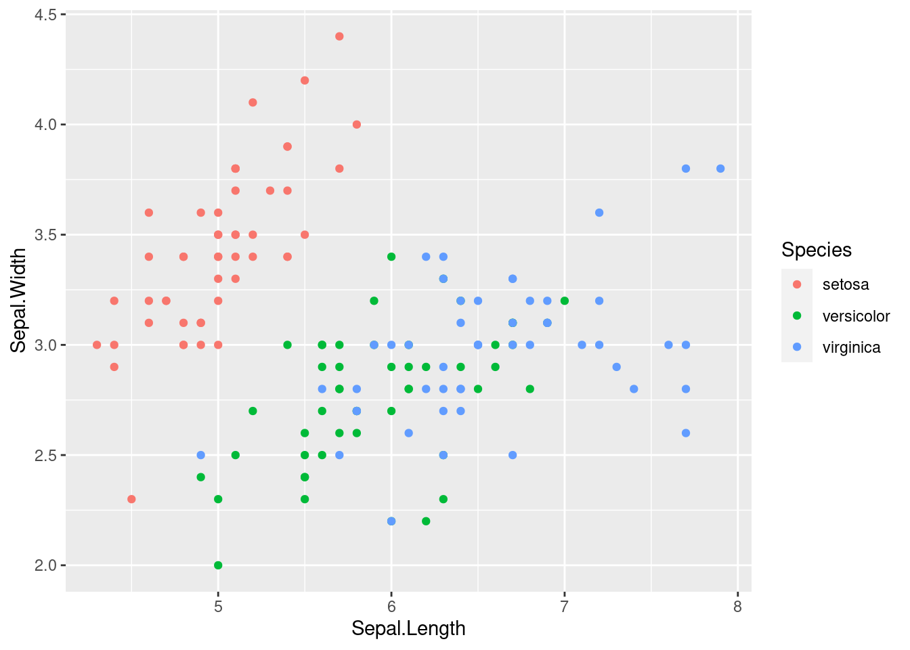
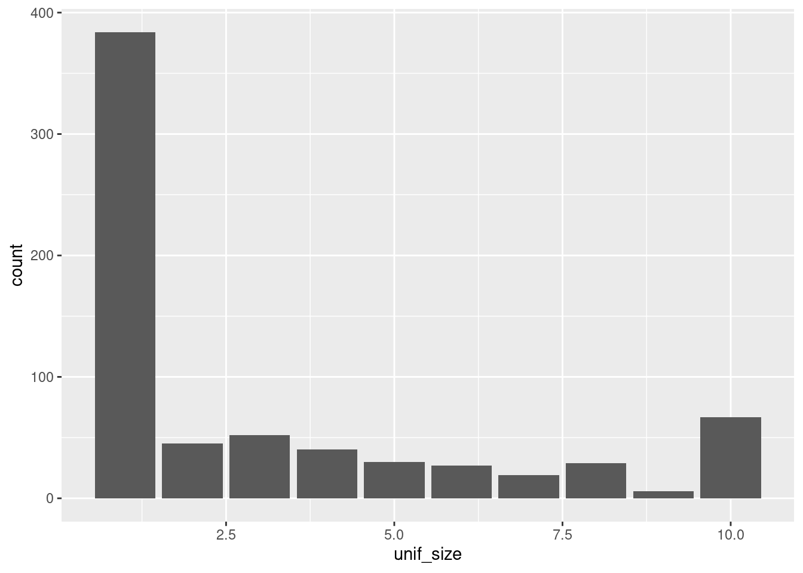
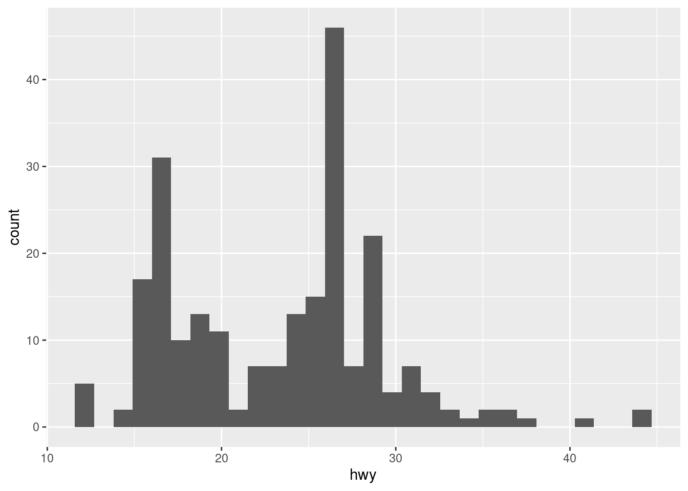

# Data visualization

## First steps into dataviz

When dealing with a very small set of data, a table can be enough for understanding it. But increasing the amount of data, even just a few rows, a proper plot can really help getting some information. Visualization is key in explaining data.

There exist several tools for visualizing data. Every stats software will provide you some packages for visualizing. There are even tools especially prepared for them, such as Qlik or PowerBI (the most typical aren't open software). 

With R base we can make lots of plots, mainly via the `plot()` function. It is important knowing this functions, since it interacts differently with the object it receives, depending on its class. For instance:


```r
plot(sample(seq(0, 1, by = 0.01)))
```


```r
plot(iris)
```


However, we are going to work with ggplot2, the most common library for visualization in R. R base is usually said to be ugly for data visualization: this is too subjective. What's true is the potential of ggplot2 is incredibly higher than base's one.

### ggplot2

The _gg_ in ggplot2 stands for _grammar of graphics_. ggplot2 provides us with a sintaxis for developing plots based on adding layers to a plot. A plot in ggplot is an object: a data frame is an object, a number is an object,... now a plot is an object too. Therefore, we can operate with it, in a especial way. 

We begin calling the library (install it if you haven't yet).


```r
library(ggplot2)
```

A plot object can be created with the `ggplot()` function. 


```r
P <- ggplot()

class(P)
```

```
## [1] "gg"     "ggplot"
```

If we try to show , we won't see anything interesting.

```r
P
```


That's because we have to fill it with:

- Data
- The axis
- Aesthetics
- Labelling
- Distribution on the board
- ...

ggplot2 belongs to the tidyverse environment, therefore it is especially appropriate working with data frames. The data frames or tibbles will be the objects we'll use for providing the plot with data. Then we'll use the rest of the ggplot2 grammar to take advantage of this data and use it for visualizing. 

### Scatter plot

The scatter plot consists on several points on the plane. It is the most typical type plot for representing two dimensions from continuous (numerical) data: height vs. weight, income vs. age, ... 

We've already seen that `ggplot()` generates a plot object. It can also receive the data frame we'll take the info from. But still, only indicating the data frame is not enough to plot anything.


```r
ggplot(iris)
```


We must indicate specific info depending on the type of plot. For scatter plots, we add a layer of points with `geom_point()`, saying what the x axis represents and what the y axis represents. 


```r
ggplot(iris) + 
  geom_point(aes(x = Sepal.Length, y = Sepal.Width))
```


We can also relate more things with the available data. For instance, we can color each point depending on some other column from the data frame. 


```r
ggplot(iris) + 
  geom_point(aes(x = Sepal.Length, y = Sepal.Width, colour = Species))
```



Notice that all this info we have used (x axis, y axis and colour) is inside the `aes()` function. If we tried to write this info outside the function we would get an error. 


```r
ggplot(iris) + 
  geom_point(aes(x = Sepal.Length, y = Sepal.Width), colour = Species)
# Error in layer(data = data, mapping = mapping, stat = stat, geom = GeomPoint, : object 'Species' not found
```

Outside `aes()` we can only include information for the graphic that doesn't depend on the data. For instance, if we wanted to colour all the points equally:


```r
ggplot(iris) + 
  geom_point(aes(x = Sepal.Length, y = Sepal.Width), colour = "darkblue")
```


Or increase its size:


```r
ggplot(iris) + 
  geom_point(aes(x = Sepal.Length, y = Sepal.Width, colour = Species), size = 2)
```


### Columns

If we are working with just one numerical dimension, points may not be the best choice. Imagine you want to compare the average value of some metric at different groups. Plots or bars are good alternatives.


```r
library(dplyr)
```

```
## 
## Attaching package: 'dplyr'
```

```
## The following objects are masked from 'package:stats':
## 
##     filter, lag
```

```
## The following objects are masked from 'package:base':
## 
##     intersect, setdiff, setequal, union
```

```r
iris2plot <- iris %>% 
  group_by(Species) %>% 
  summarise(avg_petal_length = mean(Petal.Length), 
            avg_petal_width = mean(Petal.Width))

iris2plot
```

```
## # A tibble: 3 x 3
##   Species    avg_petal_length avg_petal_width
##   <fct>                 <dbl>           <dbl>
## 1 setosa                 1.46           0.246
## 2 versicolor             4.26           1.33 
## 3 virginica              5.55           2.03
```


```r
ggplot(iris2plot) + 
  geom_col(aes(x = Species, y = avg_petal_length))
```


Similarly to the previous situation, you can decide whether extracting information from the data frame or using the same parameters for all the columns. 


```r
ggplot(iris2plot) + 
  geom_col(aes(x = Species, y = avg_petal_length), 
           fill = "#F47C00")
```


### Lines

Line plots are associated with time series. Let's have a look at the economic dataset (details with `? economics`).


```r
glimpse(economics)
```

```
## Rows: 574
## Columns: 6
## $ date     <date> 1967-07-01, 1967-08-01, 1967-09-01, 1967-10-01, 1967-11-01, …
## $ pce      <dbl> 506.7, 509.8, 515.6, 512.2, 517.4, 525.1, 530.9, 533.6, 544.3…
## $ pop      <dbl> 198712, 198911, 199113, 199311, 199498, 199657, 199808, 19992…
## $ psavert  <dbl> 12.6, 12.6, 11.9, 12.9, 12.8, 11.8, 11.7, 12.3, 11.7, 12.3, 1…
## $ uempmed  <dbl> 4.5, 4.7, 4.6, 4.9, 4.7, 4.8, 5.1, 4.5, 4.1, 4.6, 4.4, 4.4, 4…
## $ unemploy <dbl> 2944, 2945, 2958, 3143, 3066, 3018, 2878, 3001, 2877, 2709, 2…
```

When using a x axis of `Date` class, ggplot2 knows how to work with it and will try to find proper labels for the axis.  


```r
# Notice that you can include the aes() functions inside geom_line() or ggplot()

ggplot(economics, aes(date, unemploy)) + 
  geom_line()
```


Now we want to plot the median duration of unemployment (`unempmed`) along with the unemployment. With ggplot2 we just have to add more layers. 


```r
ggplot(economics) + 
  geom_line(aes(date, unemploy)) + 
  geom_line(aes(date, uempmed))
```


The problem here is that the scales of the variables are too different. One solution for solving this is rescaling the data. Google Trends, for example, divides all the data by the maximum. For transforming the data we use dplyr.


```r
scaled_economics <- economics %>% 
  select(date, unemploy, uempmed) %>% 
  mutate(unemploy = unemploy / max(unemploy), 
         uempmed = uempmed / max(uempmed))

ggplot(scaled_economics) + 
  geom_line(aes(date, unemploy)) + 
  geom_line(aes(date, uempmed))
```


We should use different colors for each series. And include a legend. Too much work. Imagine if we had to plot all the series from the data frame. Too much code. Let's simplify this.

We need the data in a different format. Have a look at the `economics_long` data frame. It contains the same information as the previous one but it has more rows and less columns. We'll learn how to make these changes to a data frame later on but for now it is enough just using this one already prepared. 


```r
glimpse(economics_long)
```

```
## Rows: 2,870
## Columns: 4
## $ date     <date> 1967-07-01, 1967-08-01, 1967-09-01, 1967-10-01, 1967-11-01, …
## $ variable <chr> "pce", "pce", "pce", "pce", "pce", "pce", "pce", "pce", "pce"…
## $ value    <dbl> 506.7, 509.8, 515.6, 512.2, 517.4, 525.1, 530.9, 533.6, 544.3…
## $ value01  <dbl> 0.0000000000, 0.0002652497, 0.0007615234, 0.0004706043, 0.000…
```

On the x axis we still want the date. On the y axis, the value that each variable gets. But if just write this, we will see that something is not working correctly. 


```r
ggplot(economics_long) +
  geom_line(aes(x = date, y = value01))
```


For obtaining the separation we want, we need to indicate that the values are separated in variables. We can do this with the `group=` parameter.


```r
ggplot(economics_long) +
  geom_line(aes(x = date, y = value01, group = variable))
```


Or directly with the `colour=` parameter, which also provides us with a legend, mandatory in such a case.


```r
ggplot(economics_long) +
  geom_line(aes(x = date, y = value01, colour = variable))
```


## Exercises about scatter plots


```r
library(ggplot2)
library(dplyr)
```


### Exercise 1

#### 1a

Have a look at the `mtcars` data frame with `glimpse()` and `? mtcars`. Then create a scatter plot of the miles per gallon (on the y axis) and the weight (on the x axis). For creating the plot, just fill in the dots in the next code.


```r
ggplot(...) +
  geom_point(aes(x = wt, y = mpg))
```


#### 1b

Repeat the previous plot, colouring all the points from the previous plot in red. Notice that since the color doesn't depend on the data frame, it is typed outside the `aes()` function.


```r
ggplot(...) +
  geom_point(aes(...), colour = "red")
```


#### 1c

Repeat the same plot but colouring the dots based on their displacement value (`disp` column).


```r
ggplot(...) +
  geom_point(aes(x = ..., y = ..., colour = ...))
```


#### 1d

Instead of colouring the dots in different colours, make them have a different size depending again on the `disp` variable.


```r
ggplot(...) +
  geom_point(aes(...))
```


### Exercise 2

#### 2a

Scatter plots can also be used for non continuous data. In R, when dealing with continuous data, we usually use the `numeric` class (weight, heights, incomes,...). But there are some variables that are written with numbers but aren't continuous (age, number of cylinders, identificators). What is the class of the number of cylinders in the `mtcars` data frame? Remember to use `? mtcars` if you don't know the name of the column in the data frame.

#### 2b

What are its unique values. Fill in the gap:


```r
mtcars %>% distinct(...)
```

#### 2c

Based on the distinct values, the class of the column it's not the best. Try to plot a scatter plot the miles per gallon (y axis) versus the number of cylinders.


```r
ggplot(mtcars) +
  geom_point(aes(...))
```


In general, nothing wrong. But the x axis shows values that are not possible (5 and 7). This is because the number of cylinders should be a categorical variable and not a numerical one. Let's fix it. 

#### 2d

In R, categorial variables belong to a new class: `factor`. We can easily convert some variables to the factor class with the `as.factor()` function.


```r
mtcars <- mtcars %>% 
  mutate(cyl = as.factor(cyl))
```

Fill in the gaps for plotting the same scatter plot as before and compare the result.


```r
ggplot(...) +
  ...
```


### Exercise 3

#### 3a

With ggplot2 you have available the `diamonds` data frame. Have a look at its info with `? diamonds` and `glimpse(diamonds)`.

#### 3b

Create a scatter plot with the price of the diamonds (y axis) vs the weight of the diamond (x axis). There are more than 50,000 diamonds, so it may take longer than expected plotting the plot.


```r
ggplot(diamonds) + 
  ...(aes(...))
```


#### 3c 

There are too many dots, therefore they overlap and the result is a cloud of data not very comfortable to look at. Let's fix it. First, reduce the size of all the points. Try with `size = 0.5`.


```r
ggplot(...) + 
  ...(aes(...), ...)
```


#### 3d

One more thing to improve it. We can give some transparency to the points. This will help us seeing where there are too many points together. The parameter used for this is called `alpha` (very common not only in R but also in other programming languages that deal with color, such as CSS). This parameter takes values from 0 (invisible) to 1 (opaque). Set this value to 0.1, alongside the already defined size. This time, you write the code from scratch, but remember that copy-pasting is key when programming.


```r
...
```


#### 3e

Now we are giving some color to the plot. This color will be based on the clarity of the diamonds, which is a column from the data frame. We are setting the transparency to 0.4, to make that overlapping easier to see.


```r
...
```


### Exercise 4

Let us create a data frame from the `countries_of_the_world.csv` file you used for Assessment 1. We will use the `clean_names()` function from the janitor library to simplify the names of the columns. We are also removing all the rows with some `NA` value.


```r
library(readr)
library(janitor)
```

```
## 
## Attaching package: 'janitor'
```

```
## The following objects are masked from 'package:stats':
## 
##     chisq.test, fisher.test
```

```r
df_countries <- read_csv("data/countries_of_the_world.csv", locale = locale(decimal_mark = ",")) %>% 
  clean_names() %>% 
  na.omit()
```

```
## 
## ── Column specification ────────────────────────────────────────────────────────
## cols(
##   .default = col_double(),
##   Country = col_character(),
##   Region = col_character()
## )
## ℹ Use `spec()` for the full column specifications.
```

```r
glimpse(df_countries)
```

```
## Rows: 179
## Columns: 20
## $ country                          <chr> "Afghanistan", "Albania", "Algeria", …
## $ region                           <chr> "ASIA (EX. NEAR EAST)", "EASTERN EURO…
## $ population                       <dbl> 31056997, 3581655, 32930091, 13477, 6…
## $ area_sq_mi                       <dbl> 647500, 28748, 2381740, 102, 443, 276…
## $ pop_density_per_sq_mi            <dbl> 48.0, 124.6, 13.8, 132.1, 156.0, 14.4…
## $ coastline_coast_area_ratio       <dbl> 0.00, 1.26, 0.04, 59.80, 34.54, 0.18,…
## $ net_migration                    <dbl> 23.06, -4.93, -0.39, 10.76, -6.15, 0.…
## $ infant_mortality_per_1000_births <dbl> 163.07, 21.52, 31.00, 21.03, 19.46, 1…
## $ gdp_per_capita                   <dbl> 700, 4500, 6000, 8600, 11000, 11200, …
## $ literacy_percent                 <dbl> 36.0, 86.5, 70.0, 95.0, 89.0, 97.1, 9…
## $ phones_per_1000                  <dbl> 3.2, 71.2, 78.1, 460.0, 549.9, 220.4,…
## $ arable_percent                   <dbl> 12.13, 21.09, 3.22, 0.00, 18.18, 12.3…
## $ crops_percent                    <dbl> 0.22, 4.42, 0.25, 0.00, 4.55, 0.48, 2…
## $ other_percent                    <dbl> 87.65, 74.49, 96.53, 100.00, 77.27, 8…
## $ climate                          <dbl> 1.0, 3.0, 1.0, 2.0, 2.0, 3.0, 4.0, 2.…
## $ birthrate                        <dbl> 46.60, 15.11, 17.14, 14.17, 16.93, 16…
## $ deathrate                        <dbl> 20.34, 5.22, 4.61, 5.34, 5.37, 7.55, …
## $ agriculture                      <dbl> 0.380, 0.232, 0.101, 0.040, 0.038, 0.…
## $ industry                         <dbl> 0.240, 0.188, 0.600, 0.180, 0.220, 0.…
## $ service                          <dbl> 0.380, 0.579, 0.298, 0.780, 0.743, 0.…
```

#### 4a 

Plot the `phones_per_1000` columns against the `literacy_percent` column, with a scatter plot.


#### 4b 

In the same plot, colour each point based on its region.


#### 4c

Make scatter plot of the `service` columns vs. the `agriculture` column. Change the size of each point depending on each population and color all of them in `"darkblue"`.


## Exercises about line plots


```r
library(ggplot2)
library(dplyr)
```


### Exercise 1

#### 1a

From the `economics` data frame plot `unemploy` vs `date` using a line plot. You will need `geom_line()`.


#### 1b

Using dplyr, calculate a new column as the unemployment rate (umemployment divided by the population). Plot this column as a time series, in a similar way you did before.


```r
economics_new <- ... %>% 
  ...(unemployment_rate = ...)

# Code for the plot:
...
```


#### 1c

Something comfortable about ggplot2 is that it is also able to make some calculations. For intance, in the previous plot, it wasn't necessary that dplyr step. We can calculate the unemployment rate on the fly. Try to use the formula `umemploy / pop` when specifying the y axis.


```r
... + 
  ...(...(x = ..., y = ...))
```


### Exercise 2

#### 2a

From the `ChickWeight` data frame, create a lines plot with the evolution over Time of the `weight` variable. Take into account that we need a different line for each `Chick`. For achieving this, map the `Chick` column to the `group=` parameter, inside the `aes()` function. 


```r
... + 
  ...(aes(x = ..., y = ..., group = ...))
```


#### 2b

Now colour each line depending on the `Diet` the chick has received.


```r
...
```


## Columns and boxplots

## Preparing the data

We will study a breast cancer dataset, very common on data analysis. It contains several cases of benign and malign cases of breast cancer with information about the biopsies. It is often used as an example for supervised modelling: the goal would be predicting whether the case is benign or malign from the rest of the variables. 

We won't get through the modelling steps but we will see how to get some insights about the relation among the explanatory variables and the _target_ variable. 


```r
library(dplyr)
library(ggplot2)
library(readr)
library(janitor)
```

We read the csv file and make some name cleaning.


```r
df_cancer <- read_csv("data/breast_cancer_data.csv", col_names = FALSE)
```

```
## 
## ── Column specification ────────────────────────────────────────────────────────
## cols(
##   X1 = col_double(),
##   X2 = col_double(),
##   X3 = col_double(),
##   X4 = col_double(),
##   X5 = col_double(),
##   X6 = col_double(),
##   X7 = col_double(),
##   X8 = col_double(),
##   X9 = col_double(),
##   X10 = col_double(),
##   X11 = col_double()
## )
```

```r
df_cancer <- clean_names(df_cancer)

glimpse(df_cancer)
```

```
## Rows: 699
## Columns: 11
## $ x1  <dbl> 1000025, 1002945, 1015425, 1016277, 1017023, 1017122, 1018099, 101…
## $ x2  <dbl> 5, 5, 3, 6, 4, 8, 1, 2, 2, 4, 1, 2, 5, 1, 8, 7, 4, 4, 10, 6, 7, 10…
## $ x3  <dbl> 1, 4, 1, 8, 1, 10, 1, 1, 1, 2, 1, 1, 3, 1, 7, 4, 1, 1, 7, 1, 3, 5,…
## $ x4  <dbl> 1, 4, 1, 8, 1, 10, 1, 2, 1, 1, 1, 1, 3, 1, 5, 6, 1, 1, 7, 1, 2, 5,…
## $ x5  <dbl> 1, 5, 1, 1, 3, 8, 1, 1, 1, 1, 1, 1, 3, 1, 10, 4, 1, 1, 6, 1, 10, 3…
## $ x6  <dbl> 2, 7, 2, 3, 2, 7, 2, 2, 2, 2, 1, 2, 2, 2, 7, 6, 2, 2, 4, 2, 5, 6, …
## $ x7  <dbl> 1, 10, 2, 4, 1, 10, 10, 1, 1, 1, 1, 1, 3, 3, 9, 1, 1, 1, 10, 1, 10…
## $ x8  <dbl> 3, 3, 3, 3, 3, 9, 3, 3, 1, 2, 3, 2, 4, 3, 5, 4, 2, 3, 4, 3, 5, 7, …
## $ x9  <dbl> 1, 2, 1, 7, 1, 7, 1, 1, 1, 1, 1, 1, 4, 1, 5, 3, 1, 1, 1, 1, 4, 10,…
## $ x10 <dbl> 1, 1, 1, 1, 1, 1, 1, 1, 5, 1, 1, 1, 1, 1, 4, 1, 1, 1, 2, 1, 4, 1, …
## $ x11 <dbl> 2, 2, 2, 2, 2, 4, 2, 2, 2, 2, 2, 2, 4, 2, 4, 4, 2, 2, 4, 2, 4, 4, …
```


```r
names(df_cancer) <- c("id", "clump", "unif_size", "unif_shape", "adhesion", 
                      "epithelial_size", "nuclei", "bland_chromatin", 
                      "normal_nucleoli", "mitoses", "class")

glimpse(df_cancer)
```

```
## Rows: 699
## Columns: 11
## $ id              <dbl> 1000025, 1002945, 1015425, 1016277, 1017023, 1017122, …
## $ clump           <dbl> 5, 5, 3, 6, 4, 8, 1, 2, 2, 4, 1, 2, 5, 1, 8, 7, 4, 4, …
## $ unif_size       <dbl> 1, 4, 1, 8, 1, 10, 1, 1, 1, 2, 1, 1, 3, 1, 7, 4, 1, 1,…
## $ unif_shape      <dbl> 1, 4, 1, 8, 1, 10, 1, 2, 1, 1, 1, 1, 3, 1, 5, 6, 1, 1,…
## $ adhesion        <dbl> 1, 5, 1, 1, 3, 8, 1, 1, 1, 1, 1, 1, 3, 1, 10, 4, 1, 1,…
## $ epithelial_size <dbl> 2, 7, 2, 3, 2, 7, 2, 2, 2, 2, 1, 2, 2, 2, 7, 6, 2, 2, …
## $ nuclei          <dbl> 1, 10, 2, 4, 1, 10, 10, 1, 1, 1, 1, 1, 3, 3, 9, 1, 1, …
## $ bland_chromatin <dbl> 3, 3, 3, 3, 3, 9, 3, 3, 1, 2, 3, 2, 4, 3, 5, 4, 2, 3, …
## $ normal_nucleoli <dbl> 1, 2, 1, 7, 1, 7, 1, 1, 1, 1, 1, 1, 4, 1, 5, 3, 1, 1, …
## $ mitoses         <dbl> 1, 1, 1, 1, 1, 1, 1, 1, 5, 1, 1, 1, 1, 1, 4, 1, 1, 1, …
## $ class           <dbl> 2, 2, 2, 2, 2, 4, 2, 2, 2, 2, 2, 2, 4, 2, 4, 4, 2, 2, …
```

## Bar plots

Bar plots are comfortable for seeing whether a variable changes depending on the level. We can have a quick look at how cases there are for a variable, for instances, `unif_size`. 


```r
ggplot(df_cancer) + 
  geom_bar(aes(x = unif_size))
```



Note that the x axis shows values as if the variable were numeric. In fact, it is categorical (this is easy to see if look up some documentation about the dataset online), since there are ten classes, not ten numbers, even though these classes are represented by 1, 2, 3.... Since we don't have a dictionary for the classes, we can transform the variable directly into a categorical one, taking the numbers as the names. This can be done with dplyr but also with ggplot.


```r
ggplot(df_cancer) + 
  geom_bar(aes(x = as.factor(unif_size)))
```


The same problem will we have if we try to plot the classes of the target variable.


```r
ggplot(df_cancer) + 
  geom_bar(aes(x = class))
```


Again, we change it to a `factor` variable.


```r
ggplot(df_cancer) + 
  geom_bar(aes(x = as.factor(class)))
```


Instead of working with the numeric labels, we can work with a `character` column and then create the `factor` column.


```r
df_cancer_new <- df_cancer %>% 
  mutate(class = if_else(class == 2, "benign", "malign"))

df_cancer_new %>%
  distinct(class)
```

```
## # A tibble: 2 x 1
##   class 
##   <chr> 
## 1 benign
## 2 malign
```


```r
df_cancer_new <- df_cancer %>% 
  mutate(class = factor(class))

df_cancer_new %>%
  distinct(class)
```

```
## # A tibble: 2 x 1
##   class
##   <fct>
## 1 2    
## 2 4
```

Other way around is defining directly the factor with the proper labels. 


```r
df_cancer_new <- df_cancer %>% 
  mutate(class = factor(class, labels = c("benign", "malign")))

df_cancer_new %>%
  distinct(class)
```

```
## # A tibble: 2 x 1
##   class 
##   <fct> 
## 1 benign
## 2 malign
```

In any case, the x axis now shows the correct labels. 


```r
ggplot(df_cancer_new) + 
  geom_bar(aes(x = class))
```


Let's mix some info. Here we plot the number of cases (the distribution) of `epithelial_size`.


```r
ggplot(df_cancer_new) + 
  geom_bar(aes(x = epithelial_size))
```


But we can tell ggplot to include the number of cases for the target variable. We want it to fill part of the column in one color and the rest in other color, depending on the number of malign and benign cases.


```r
ggplot(df_cancer_new) + 
  geom_bar(aes(x = as.factor(epithelial_size), fill = class))
```


Note that we used `fill=`. `col=` works differently.


```r
ggplot(df_cancer_new) + 
  geom_bar(aes(x = as.factor(epithelial_size), col = class))
```


Take also into account that we are writing this statements (`fill=`) inside the `aes()` function, since we want to use information from the data frame for colouring. If we wanted to change the color of all the bars uniformly, we would write outside the `aes()` function something like `fill = "darkblue"`.

By default, ggplot plots the columns stacked, one on top of the other for the same class indicated in the `x=` atribute. Having them at the same level is called _dodge_ and this can be achieved with the `position=` atribute. It doesn't depend on the data frame, so we write it outside the `aes()` function. By default, ggplot takes `position = "dodge"`. We can change it:


```r
ggplot(df_cancer_new) + 
  geom_bar(aes(x = as.factor(epithelial_size), fill = class), position = "dodge")
```


## Histograms

Histograms are one of the most common plots for visualizing the distribution of one continuous variable (income, age, height, population,...). The `geom` used is `geom_histogram()` and the main parameter for the `aes()` function is `x=`, though you can also include some of the parameters available for `geom_bar()`. Have a look at the documentation for histograms. 


```r
ggplot(mpg) + 
  geom_histogram(aes(x = hwy))
```

```
## `stat_bin()` using `bins = 30`. Pick better value with `binwidth`.
```



When plotting a histogram, we'll receive a message saying the number of bins (columns) used by the default. For avoiding it, we need to set a number of bins or, more appropriate, their width (in relation to the variable whose distribution we are studying).


```r
ggplot(mpg) + 
  geom_histogram(aes(x = hwy), binwidth = 5)
```


The plot changes a lot depending on this parameter, so be careful: a histogram with too many bins can be useless because it may not show differences among the values, but with too few can hide nuances.

Histograms are useful for getting an idea of the general distribution of a variable but not for specific values. 


```r
library(readr)
library(janitor)

df_countries <- read_csv("data/countries_of_the_world.csv", locale = locale(decimal_mark = ",")) %>% 
  clean_names() %>% 
  tidyr::drop_na()
```

```
## 
## ── Column specification ────────────────────────────────────────────────────────
## cols(
##   .default = col_double(),
##   Country = col_character(),
##   Region = col_character()
## )
## ℹ Use `spec()` for the full column specifications.
```

```r
glimpse(df_countries)
```

```
## Rows: 179
## Columns: 20
## $ country                          <chr> "Afghanistan", "Albania", "Algeria", …
## $ region                           <chr> "ASIA (EX. NEAR EAST)", "EASTERN EURO…
## $ population                       <dbl> 31056997, 3581655, 32930091, 13477, 6…
## $ area_sq_mi                       <dbl> 647500, 28748, 2381740, 102, 443, 276…
## $ pop_density_per_sq_mi            <dbl> 48.0, 124.6, 13.8, 132.1, 156.0, 14.4…
## $ coastline_coast_area_ratio       <dbl> 0.00, 1.26, 0.04, 59.80, 34.54, 0.18,…
## $ net_migration                    <dbl> 23.06, -4.93, -0.39, 10.76, -6.15, 0.…
## $ infant_mortality_per_1000_births <dbl> 163.07, 21.52, 31.00, 21.03, 19.46, 1…
## $ gdp_per_capita                   <dbl> 700, 4500, 6000, 8600, 11000, 11200, …
## $ literacy_percent                 <dbl> 36.0, 86.5, 70.0, 95.0, 89.0, 97.1, 9…
## $ phones_per_1000                  <dbl> 3.2, 71.2, 78.1, 460.0, 549.9, 220.4,…
## $ arable_percent                   <dbl> 12.13, 21.09, 3.22, 0.00, 18.18, 12.3…
## $ crops_percent                    <dbl> 0.22, 4.42, 0.25, 0.00, 4.55, 0.48, 2…
## $ other_percent                    <dbl> 87.65, 74.49, 96.53, 100.00, 77.27, 8…
## $ climate                          <dbl> 1.0, 3.0, 1.0, 2.0, 2.0, 3.0, 4.0, 2.…
## $ birthrate                        <dbl> 46.60, 15.11, 17.14, 14.17, 16.93, 16…
## $ deathrate                        <dbl> 20.34, 5.22, 4.61, 5.34, 5.37, 7.55, …
## $ agriculture                      <dbl> 0.380, 0.232, 0.101, 0.040, 0.038, 0.…
## $ industry                         <dbl> 0.240, 0.188, 0.600, 0.180, 0.220, 0.…
## $ service                          <dbl> 0.380, 0.579, 0.298, 0.780, 0.743, 0.…
```

If we don't control a bit the values, the plot won't be useful. For instance, histograms are very sensitive to extreme values.


```r
ggplot(df_countries) + 
  geom_histogram(aes(x = population))
```

```
## `stat_bin()` using `bins = 30`. Pick better value with `binwidth`.
```


```r
df_countries_redux <- df_countries %>% 
  # filter(!country %in% c("China", "India")) %>% 
  filter(population <= 100000000)

ggplot(df_countries_redux) + 
  geom_histogram(aes(x = population))
```

```
## `stat_bin()` using `bins = 30`. Pick better value with `binwidth`.
```


From the plot, could you say what is the mean of the population?


```r
df_media <- df_countries_redux %>% 
  summarise(media = mean(population), 
            mediana = median(population), 
            q1 = quantile(population, probs = 0.25),
            q3 = quantile(population, probs = 0.75))

ggplot(df_countries_redux) + 
  geom_histogram(aes(x = population), bins = 30) + 
  geom_vline(xintercept = df_media$media, col = "red", size = 1, linetype = 2)
```


Would you say than the median is higher or lower?


```r
ggplot(df_countries_redux) + 
  geom_histogram(aes(x = population), bins = 30) + 
  geom_vline(xintercept = df_media$media, col = "red", size = 1, linetype = 2) +
  geom_vline(xintercept = df_media$mediana, col = "blue", size = 0.5, linetype = 2)
```


The mean is very sensitive to outliers. The median is usually a better aggregation measure when the distribution is not symmetrical.

We can also include the quartiles.


```r
ggplot(df_countries_redux) + 
  geom_histogram(aes(x = population), bins = 30) + 
  geom_vline(xintercept = df_media$media, col = "red", size = 1, linetype = 2) +
  geom_vline(xintercept = df_media$mediana, col = "blue", size = 0.5, linetype = 2) +
  geom_vline(xintercept = df_media$q1, col = "green", size = 0.5, linetype = 2) +
  geom_vline(xintercept = df_media$q3, col = "green", size = 0.5, linetype = 2)
```


Between the two green lines there are 50% of the countries (after excluding the largest ones).

So, the histogram allows us seeing some general properties of the distribution (outliers, asymmetrical distribution, lots of observations concentrated around a particular value) but it's not comfortable for detecting some typical statistics.


## Boxplots


```r
ggplot(df_countries_redux) + 
  geom_boxplot(aes(y = population))
```


```r
ggplot(df_countries_redux) + 
  geom_boxplot(aes(x = region, y = population))
```


## Some improvements

Not the best option here, but useful sometimes:

```r
ggplot(df_countries_redux) + 
  geom_boxplot(aes(x = region, y = population)) + 
  theme(axis.text.x = element_text(angle = 90))
```


```r
ggplot(df_countries_redux) + 
  geom_boxplot(aes(x = region, y = population)) + 
  coord_flip()
```


Some changes in the labels:


```r
ggplot(df_countries_redux) + 
  geom_boxplot(aes(x = region, y = population)) + 
  labs(x = "Región", y = "Población", title = "Distribución de población") + 
  coord_flip()
```


We can also set a white rectangle, instead of grey.


```r
ggplot(df_countries_redux) + 
  geom_boxplot(aes(x = region, y = population)) + 
  labs(x = "Región", y = "Población", title = "Distribución de población") + 
  coord_flip() + 
  theme(panel.background = element_blank())
```


Changing the format of the numbers is a bit tricky (espcially for the Spanish format: we show here the English format).


```r
ggplot(df_countries_redux) + 
  geom_boxplot(aes(x = region, y = population)) + 
  labs(x = "Región", y = "Población", title = "Distribución de población") + 
  coord_flip() + 
  scale_y_continuous(labels = scales::number) + 
  theme(panel.background = element_blank())
```


Data visualization good practices recommend arranging the data. In some cases this can be achieved easily with ggplot, but in this boxplot case we will need dplyr and the factor class.

There are several approaches: this is just one.


```r
df_regiones_ordenadas <- df_countries_redux %>% 
  group_by(region) %>% 
  summarise(mediana = median(population)) %>% 
  arrange(mediana) %>% 
  mutate(region = forcats::as_factor(region))

  
df_countries_redux %>% 
  mutate(region = factor(region, levels = df_regiones_ordenadas$region)) %>% 
  ggplot() + 
  geom_boxplot(aes(x = region, y = population)) + 
  labs(x = "Región", y = "Población", title = "Distribución de población") + 
  coord_flip() + 
  scale_y_continuous(labels = scales::number) + 
  theme(panel.background = element_blank())
```


## Mixing data


```r
df_countries %>% 
  mutate(literacy_percent_90 = literacy_percent > 90) %>%
  ggplot() + 
  geom_boxplot(aes(x = literacy_percent_90, y = gdp_per_capita, fill = region))
```


### Exercise

Generate a column plot similar to the previous boxplot, but comparing the average of the gpd_per_capita. _Hint._ Have a look at the documentation of `geom_col()` for learning how to set a dodge position in the columns.


```
## `summarise()` has grouped output by 'region'. You can override using the `.groups` argument.
```


## Facets: The basics

Firstly, we create a scatter plot comparing the miles per gallon variable against the weight of the car, from the `mtcars` data frame. 


```r
library(ggplot2)

ggplot(mtcars, aes(x = wt, y = mpg)) +
  geom_point()
```


We know want to see what happens when we take into account the categorical variable Transmission type `am`. We could try plotting the points with different colors or shapes depending on their `am` value but, when possible, the best way is comparing their position on different plots that have the same axis.

We would like to do something like these two plots (we combine dplyr and ggplot2):


```r
library(dplyr)

mtcars %>% 
  filter(am == 0) %>% 
  ggplot(aes(x = wt, y = mpg)) +
  geom_point()
```


```r
mtcars %>% 
  filter(am == 1) %>% 
  ggplot(aes(x = wt, y = mpg)) +
  geom_point()
```


But they don't have the same axis and are not disposed in a proper way, so comparing them for understanding the differences between the two distributions is not comfortable. ggplot2 may help.

We are going to create two scatter plots: one per each value of the `am` column. Both they'll have the same axis, so it'll be easier comparing the relative position of the dots, which is the easiest way of getting differences between the values of a continuous variable. 


```r
ggplot(mtcars, aes(x = wt, y = mpg)) +
  geom_point() + 
  facet_grid(am ~ .)
```


In the plot is easy to see that automatic cars (`am == 0`) heavier (x axis) and that manual cars are associated with more miles per gallon (y axis). 

Let's have a look at the sintax. The `ggplot()` and the `geom_point()` have already been study. What we are doing is adding a new layer, a faceting layer. What we achieve is that we will repeat the plot generated with the `ggplot() + geom_point()` schema, for each value in the `am` column. The `facet_grid()` function creates a grid for all the desired plot. It receives a formula based on the `~` sintax. Before the `~` we include the variable whose values will define the rows of the grid; after the `~`, we write the variable for defining the columns. A `.` is written when no difference is made. 

**Remember.** For comparing a continuous variable for several observations, focusing on the position is more comfortable than changing the colors or the shape. 

Let's try the same comparison with different colors for each point, depending on their transmission. 


```r
ggplot(mtcars, aes(x = wt, y = mpg, color = as.factor(am))) +
  geom_point()
```


Or the shape.

```r
ggplot(mtcars, aes(x = wt, y = mpg, shape = as.factor(am))) +
  geom_point()
```


Now we want to include a new variable: the number of cylinders. Let's assume that we preferred the previous plot with the shape aesthetic. Let's add the color for understanding differences between the `cyl` variable.


```r
ggplot(mtcars, aes(x = wt, y = mpg, shape = as.factor(am), color = as.factor(cyl))) +
  geom_point()
```


A mess. Again, it is better taking advantage of the spatial distribution, since our eye understand better differences on the position. 

For doing this, facets:


```r
ggplot(mtcars, aes(x = wt, y = mpg)) +
  geom_point() + 
  facet_grid(am ~ cyl)
```


Here, we define the grid from the `am` variable and the `cyl` variable for the columns. 

## Many variables in just one plot

Know, an extreme example is shown. The next pieces of codes will help us creating a plot where up to 7 variables are studied.

First we create the set of color that we'll use for the points. We define a special object we haven't used yet: a matrix. It will contain character elements with the desired colors (instead of names of color, hexadecimal codes are used). The blue colors will be associated with the automatic cars and the red colors, with the manual cars. Lighter colors will be related to lower number of cylinders (for this transparency, the `brewer.pal()` will take care of it).


```r
mtcars <- mtcars %>% 
  mutate(cyl_am = paste(cyl, am, sep = "_"))

myCol <- rbind(RColorBrewer::brewer.pal(9, "Blues")[c(3,6,8)],
               RColorBrewer::brewer.pal(9, "Reds")[c(3,6,8)])

# Basic scatter plot, add color scale:
ggplot(mtcars, aes(x = wt, y = mpg, col = cyl_am)) +
  geom_point()+
  scale_color_manual(values = myCol)
```


Now we also include a visualization for getting differences considering `gear` and `vs`. This can be done with facets.


```r
ggplot(mtcars, aes(x = wt, y = mpg, col = cyl_am)) +
  geom_point()+
  scale_color_manual(values = myCol)+
  facet_grid(gear ~ vs)
```


Finally, we include information about `disp`, mapping it to the size of the points.


```r
ggplot(mtcars, aes(x = wt, y = mpg, col = cyl_am, size = disp)) +
  geom_point() +
  scale_color_manual(values = myCol) +
  facet_grid(gear~vs)
```


## Something more

### Pivoting data

Data will often be in such a format that cannot be properly used for visualization. The packages on the _tidyverse_ environment can help us dealing with this.

On the `msleep` dataset we have information about how much time some mammals sleep. About this time, there are two columns: `sleep_total` and `sleep_rem`. We want to visualize both times depending on the animal. How can we visualize this two variables at the same time, if they are two columns?

A first approach could be using two layers of points.


```r
ggplot(msleep) + 
  geom_point(aes(x = sleep_total, y = name), color = "blue") + 
  geom_point(aes(x = sleep_rem, y = name), color = "red")
```

```
## Warning: Removed 22 rows containing missing values (geom_point).
```


Things we don't like about this plot:

- There is no legend (it can be added but with more code). 
- We had to decide the colors explicitally (ggplot2 usually knows how to decide what color is the best).
- If we would like to work with more categories, we would have to add one more like per category (and decide a color).
- The x axis has the label of the first layer. It can be changed but, again, is one more line.

Instead of this, we would like to specify ggplot that it has to create a plot of the name of the mammal against the sleeping time. This _time_ unit is divided into several categories (rem and total), and we will use these categories for coloring the points. To sum up, right now in the data frame we have one row per mammal, and two columns about the sleeping time. We want to redefine the data frame so that we will have two rows per mammal: one for the total time and one for the rem time.

This is called pivoting. Let's have a look at the actual data (we select only the columns that will be used):


```r
msleep %>% 
  select(vore, name, sleep_total, sleep_rem) %>% 
  slice(1:6)
```

```
## # A tibble: 6 x 4
##   vore  name                       sleep_total sleep_rem
##   <chr> <chr>                            <dbl>     <dbl>
## 1 carni Cheetah                           12.1      NA  
## 2 omni  Owl monkey                        17         1.8
## 3 herbi Mountain beaver                   14.4       2.4
## 4 omni  Greater short-tailed shrew        14.9       2.3
## 5 herbi Cow                                4         0.7
## 6 herbi Three-toed sloth                  14.4       2.2
```

What we want to achieve is this:


```
## # A tibble: 12 x 4
##    vore  name                       sleep        time
##    <chr> <chr>                      <chr>       <dbl>
##  1 carni Cheetah                    sleep_total  12.1
##  2 carni Cheetah                    sleep_rem    NA  
##  3 omni  Owl monkey                 sleep_total  17  
##  4 omni  Owl monkey                 sleep_rem     1.8
##  5 herbi Mountain beaver            sleep_total  14.4
##  6 herbi Mountain beaver            sleep_rem     2.4
##  7 omni  Greater short-tailed shrew sleep_total  14.9
##  8 omni  Greater short-tailed shrew sleep_rem     2.3
##  9 herbi Cow                        sleep_total   4  
## 10 herbi Cow                        sleep_rem     0.7
## 11 herbi Three-toed sloth           sleep_total  14.4
## 12 herbi Three-toed sloth           sleep_rem     2.2
```

The information is the same on both tables, but the second one has a long format (more rows) and the first one has a wide format (more columns). Depending on what you are doing, you will prefer one or the other. For instance, for statistical modelling, the wide format may be preferred; for data visualization, the longer one is preferred (at least, for this example).

Changing a data frame between this two formats is called pivoting. In R, there lots of tools for achieving this. As usual, we show one:


```r
library(tidyr)

mamsleep <- msleep %>% 
  select(vore, name, sleep_total, sleep_rem) %>% 
  pivot_longer(cols = one_of(c("sleep_total", "sleep_rem")), names_to = "sleep", values_to = "time")

glimpse(mamsleep)
```

```
## Rows: 166
## Columns: 4
## $ vore  <chr> "carni", "carni", "omni", "omni", "herbi", "herbi", "omni", "omn…
## $ name  <chr> "Cheetah", "Cheetah", "Owl monkey", "Owl monkey", "Mountain beav…
## $ sleep <chr> "sleep_total", "sleep_rem", "sleep_total", "sleep_rem", "sleep_t…
## $ time  <dbl> 12.1, NA, 17.0, 1.8, 14.4, 2.4, 14.9, 2.3, 4.0, 0.7, 14.4, 2.2, …
```

### Basic scatter plot

```r
ggplot(mamsleep,aes(x = time, y = name, col = sleep)) +
  geom_point()
```

```
## Warning: Removed 22 rows containing missing values (geom_point).
```


### Facet rows accoding to vore

Now we separate the plot in several parts, depending on what the mammals eat. We will prepare a grid, as we did before, using facets.


```r
ggplot(mamsleep, aes(x = time, y = name, col = sleep)) +
geom_point() +
facet_grid(vore ~ .)
```

```
## Warning: Removed 22 rows containing missing values (geom_point).
```


It is as if we had made for plots: a first one having `vore == "carni"`, a second one with `vore == "herbi"`, etc.

### Specify scale and space arguments to free up rows

The x axis must be common for all the plots, because it is the most comfortable way for comparing the `time` value among the different points, even if they are on different parts of the grid. However, there is no need on having the same y axis on all of them, because it's not that what we are comparing. We can free the y axis, so that it shows only the important values for each plot.


```r
ggplot(mamsleep, aes(x = time, y = name, col = sleep ))+
geom_point()+
facet_grid(vore ~ ., scales = "free_y", space = "free_y")
```

```
## Warning: Removed 22 rows containing missing values (geom_point).
```


For gaining some space, we can set the legend on the bottom of the plot.


```r
ggplot(mamsleep, aes(x = time, y = name, col = sleep )) +
  geom_point() +
  facet_grid(vore ~ ., scales = "free_y", space = "free_y") + 
  theme(legend.position = "bottom")
```

```
## Warning: Removed 22 rows containing missing values (geom_point).
```


This exercise, except the last section, has been downloaded from Datacamp and it is a project created by Antonio Sánchez Chinchón, data scientist at Telefonica.

## United Nations life expectancy data 

Life expectancy at birth is a measure of the average a living being is expected to live. It takes into account several demographic factors like gender, country, or year of birth.

Life expectancy at birth can vary along time or between countries because of many causes: the evolution of medicine, the degree of development of countries, or the effect of armed conflicts. Life expectancy varies between gender, as well. The data shows that women live longer that men. Why? Several potential factors, including biological reasons and the theory that women tend to be more health conscious.

Let's create some plots to explore the inequalities about life expectancy at birth around the world. We will use a dataset from the United Nations Statistics Division, which is available [here](http://data.un.org/Data.aspx?d=GenderStat&f=inID:37&c=1,2,3,4,5,6&s=crEngName:asc,sgvEngName:asc,timeEngName:desc&v=1).

For doing this:

- Load the readr, dplyr, tidyr and ggplot2 packages.
- Read `UNdata.csv` into a data frame and name it `life_expectancy`.
- Print the first few rows of life_expectancy.
- Have a look at the first rows with `head()`.


```r
# This sets plot images to a nice size
options(repr.plot.width = 6, repr.plot.height = 6)

# Loading packages
library(...)
library(...)
library(...)
library(...)

# Loading data
... <- read_csv(...)

# Taking a look at the first few rows
head(life_expectancy)
```


```
##   Country.or.Area Subgroup      Year
## 1     Afghanistan   Female 2000-2005
## 2     Afghanistan   Female 1995-2000
## 3     Afghanistan   Female 1990-1995
## 4     Afghanistan   Female 1985-1990
## 5     Afghanistan     Male 2000-2005
## 6     Afghanistan     Male 1995-2000
##                                                          Source  Unit Value
## 1 UNPD_World Population Prospects_2006 (International estimate) Years    42
## 2 UNPD_World Population Prospects_2006 (International estimate) Years    42
## 3 UNPD_World Population Prospects_2006 (International estimate) Years    42
## 4 UNPD_World Population Prospects_2006 (International estimate) Years    41
## 5 UNPD_World Population Prospects_2006 (International estimate) Years    42
## 6 UNPD_World Population Prospects_2006 (International estimate) Years    42
##   Value.Footnotes
## 1              NA
## 2              NA
## 3              NA
## 4              NA
## 5              NA
## 6              NA
```

## Life expectancy of men vs. women by country

Let's manipulate the data to make our exploration easier. We will build the dataset for our first plot in which we will represent the average life expectancy of men and women across countries for the last period recorded in our data (2000-2005).

Task: manipulate the dataset to contain male and female life expectancy for each country.

- Filter `life_expectancy` to obtain all records such as Year is equal to `"2000-2005"`.
- Subset the dataset to include just three columns: `Country.or.Area`, `Subgroup`, and `Value`.
- Have a look at how `pivot_wider()` from the tidyr package is used for converting `Subgroup` into two other columns called `Female` and `Male`, reshaping dataset from long to wide. Try to understand what it's doing. There's nothing to write. Maybe printing the number for rows and columns before and after pivoting will help seeing how the data frame is transformed.
- Print the first rows of the resulting dataset.


```r
# Subsetting and reshaping the life expectancy data
subdata <- life_expectancy  %>% 
    filter(...) %>% 
    select(...) %>%
    pivot_wider(names_from = Subgroup, values_from = Value)

# Taking a look at the first few rows
...
```


```
## # A tibble: 6 x 3
##   Country.or.Area Female  Male
##   <chr>            <int> <int>
## 1 Afghanistan         42    42
## 2 Albania             79    73
## 3 Algeria             72    70
## 4 Angola              43    39
## 5 Argentina           78    71
## 6 Armenia             75    68
```

## Visualize (I)

A scatter plot is a useful way to visualize the relationship between two variables. It is a simple plot in which points are arranged on two axes, each of which represents one of those variables.

Let's create a scatter plot using ggplot2 to represent life expectancy of males (on the x-axis) against females (on the y-axis). We will create a straightforward plot in this task, without many details. We will take care of these kinds of things shortly.

For creating a basic scatter plot for male vs. female life expectancy:

- Use the `ggplot()` function to initialize a ggplot object. Declare `subdata` as the input data frame and set the aesthetics to represent `Male` on the x-axis and `Female` on the y-axis.
- Add a layer to represent observations with points using `geom_point()`.


```r
# Plotting male and female life expectancy
ggplot(..., aes(...)) + 
  ...()
```


## Reference lines (I)
A good plot must be easy to understand. There are many tools in ggplot2 to achieve this goal and we will explore some of them now. Starting from the previous plot, let's set the same limits for both axes as well as place a diagonal line for reference. After doing this, the difference between men and women across countries will be easier to interpret.

After completing this task, we will see how most of the points are arranged above the diagonal and how there is a significant dispersion among them. **What does this all mean?**

Tasks:

- Copy your previous scatter plot code.
- Add a dashed diagonal line that passes by (0, 0) with slope equal to 1.
- Set limit of x-axis from 35 to 85.
- Set limit of y-axis from 35 to 85.


```r
ggplot(..., aes(...)) + 
  ...() + 
  geom_abline(slope = 1, intercept = 0) + 
  scale_x_continuous(limits = c(..., ...))+
  scale_y_continuous(limits = c(..., ...))
```


## Plot titles and axis labels

A key point to make a plot understandable is placing clear labels on it. Let's add titles, axis labels, and a caption to refer to the source of data. Let's also change the appearance to make it clearer.

Tasks for adding plot titles and axis labels.

- Add the plot title: `"Life Expectancy at Birth by Country"`.
- Add the next caption: `"Source: United Nations Statistics Division"`.
- Set the x-axis label to `"Males"`.
- Set the y-axis label to `"Females"`.
- Have a look at the changes that can be made to the points, in order to improve the plot a bit (that's done inside the geom_point() call). Make sure you understand the parameters.
- Note that the points can have color and filling if we give them `shape = 21`, which means than it is not just a point, but a circle or bubble, with border and area. This is useful for plotting several variables at the same time with the `aes()` function (one would be mapped to `colour=` and the other to `fill=`).


```r
# Adding labels to previous plot
ggplot(..., aes(...)) + 
  ...(colour="white", fill="chartreuse3", shape=21, alpha=.55, size=5) + 
  geom_...(slope = 1, intercept = 0) + 
  scale_x_continuous(limits = c(..., ...)) +
  scale_y_continuous(limits = c(..., ...)) +
  labs(title = ...,
       subtitle = ...,
       caption = ...,
       x = ...,
       y = ...)
```


## Highlighting remarkable countries (I)

Now, we will label some points of our plot with the name of its corresponding country. We want to draw attention to some special countries where the gap in life expectancy between men and women is significantly high. These will be the final touches on this first plot.

Tasks:

- Modify the `ggplot(...)` function to set the label parameter to Country.or.Area.
- Add a label to countries defined by `top_male` (the data frame is built for you). Note that this consists on adding a new layer to the plot.
- Add a label to countries defined by `top_female` (the data frame is built for you). Note that this consists on adding a new layer to the plot.
- Change the plot theme to `theme_bw()`. Note that this consists on adding a new layer to the plot. The plot will be lighter, with less elements.
- Make sure you copy and paste anything missing from the previous plot.


```r
# Subseting data to obtain countries of interest
top_male <- subdata %>% 
  arrange(Male-Female) %>% 
  head(3)

top_female <- subdata %>% 
  arrange(Female-Male) %>% 
  head(3)

top_male
```

```
## # A tibble: 3 x 3
##   Country.or.Area    Female  Male
##   <chr>               <int> <int>
## 1 Russian Federation     72    58
## 2 Belarus                75    63
## 3 Estonia                77    65
```

```r
top_female
```

```
## # A tibble: 3 x 3
##   Country.or.Area Female  Male
##   <chr>            <int> <int>
## 1 Niger               54    55
## 2 Afghanistan         42    42
## 3 Maldives            66    66
```


```r
# Adding text to the previous plot to label countries of interest
ggplot(..., aes(...)) + 
  ...(... = "white", ... = "chartreuse3", shape = 21, alpha = .55, size = 5) + 
  geom_...(slope = 1, intercept = 0) + 
  geom_text(data = top_male) + 
  geom_...(data = ...) + 
  scale_x_continuous(limits = c(..., ...)) +
  scale_y_continuous(limits = c(..., ...)) +
  labs(title = ...,
       subtitle = ...,
       caption = ...,
       x = ...,
       y = ...) + 
  theme_bw()
```


## GIF

We can also include information about the evolution over time of these data. There are several periods of five years, so we are going to generate a plot per period, so that we have like a movie of plots.

The easy way of doing this is using the gganimate package, but it only works with numerical data or dates. Here we have a character for the `Year` column, with data in this format: `"1990-1995"`. We will trick this a bit so that we can take advantage from the library. We transform the data frame with dplyr and tidyr. 

Remember that before using the data frame for the plot, we have to transform it into a wide format. Again, we do this with tidyr and its `pivot_wider()` function. Then, we use `mutate()` for changing the `Year` column. We use `stringr` for getting the first year of the period (originally, the column is a factor but we can work with it as if it were a character). Then we change it to numeric. This code has been provided for you.

Finally, we crate a data frame just with the Spanish data. We will use this for tracking Spain during all the evolution.


```r
df_subdata2 <- life_expectancy %>%
  select(Country.or.Area, Subgroup, Year, Value) %>% 
  filter(Subgroup %in% c("Female", "Male")) %>% 
  pivot_wider(names_from = ..., values_from = ...) %>% 
  mutate(Year = stringr::str_sub(Year, 1, 4), 
         Year = as.numeric(Year))

df_country_selection <- df_subdata2 %>% 
  filter(...)
```


Now the data frame has been created, we use it as input for the plot.

- First, we call the library gganimate. It includes a function `transition_time()`, which is used a new layer in the plot. It receives the column of the data frame that will be used as time. In this function, even though we are using a column from the data frame, **we don't use the `aes()` function.**
- We replicate the previous plot. The only change is that we are only using one `geom_text()` layer, for the Spanish data. It should receive the `df_country_selection` data frame in the `data=` parameter.
- Have a look a the `subtitle=` label. Instead of writing the same as before, we now want it to vary depending on the year. The `transition_time()` creates a variable called `frame_time` that will indicate which `Year` is using for each frame. The original format it generates is ugly, so we adapt it with the `scales::number()` function. The curly brackets `{` are important in order to indicate R that what is within them must be evaluated. If we didn't use them, R would understand that operation as a simple character. For a better understanding on how the curly bracktes work, try not writing them.
- The `transition_time()` receives the column used for the time evolution, `Time` in this case. Remember, without `aes()` function.


```r
library(...)

ggplot(...)+
  geom_...(...) + # points
  geom_...(...) + # line
  geom_...(data = ...) + # text
  scale_x_...(...) +
  scale_y_...(...) +
  labs(title="Life Expectancy at Birth by Country",
       subtitle="Years. Period: {scales::number(frame_time)}. Average.",
       caption="Source: United Nations Statistics Division",
       x="Males",
       y="Females")+
  theme_bw() +
  transition_time(...)
```


