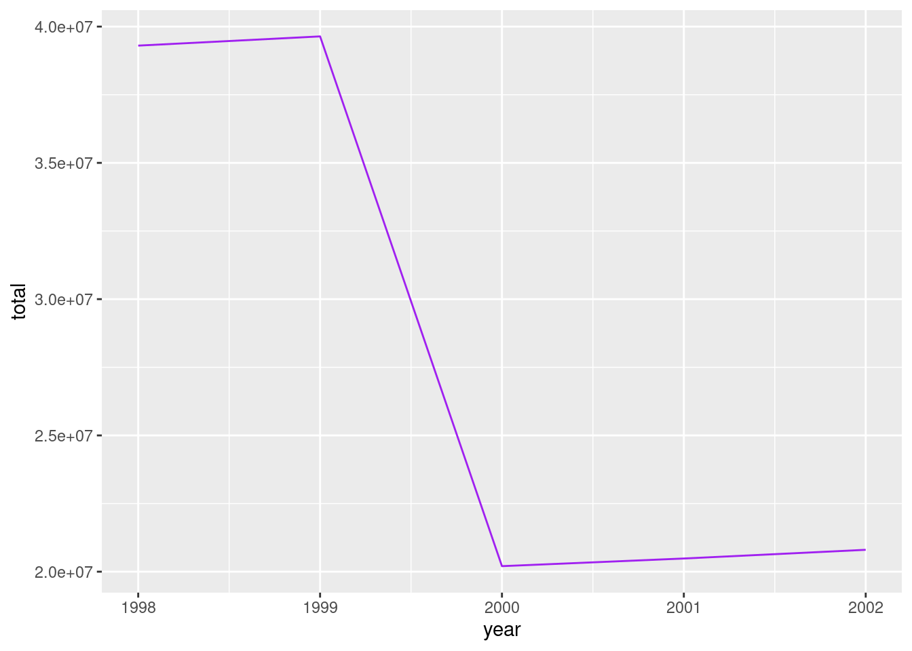

# Programming concepts 

## Purpose of functions

Simulating random data consists on generating a sample of numbers that seems random (this sounds vague but there are statistical ways of quantifying this similarity). For doing this, you need an algorithm that from a seed (a beginning number) will make several calculations that will return a new number. This new number is used for calculating the next. You can force that these generated numbers will have a gaussian distribution, or uniform, or be binary (as if they were heads and tails), whatever you need. 

You may know some algorithms that perform this, but coding it is tedious. In R (or any statistical tool) you can easily generate such a sequence with just a tiny piece of code. You just need a function. 

Imagine you want to randomly simulate some numbers with a gaussian distribution. You could study the algorithm and coding it, and execute that code whenever you need a new simulation, or you can use the `rnorm()` function. 

A function is a piece of code with a name (_rnorm_ in this case) that will execute the code that it represents (behind `rnorm()` that generator algorithm is written).


```r
x <- rnorm(1000)
head(x)
```

```
## [1] -0.1527525  0.3933449 -0.8344265  0.3852894  1.5503472 -0.7401919
```

`head()` is also a function. You already know it. It shows the first six elements of what it receives.

We can now have a look at the entire generated vector to confirm it is gaussian, maybe with a plot. For intance, a histogram


```r
hist(x)
```


The `hist()` function receives a vector and plots its histogram. Can you imagine having to plot manually a histogram like this every time a new vector is generated? Fortunately, with just one word you can get it done.

## The arguments

We are going to work with randomly generated data. This is a bit tricky. A computer needs always a formula to do something, therefore nothing is random. Random data seems random according to some statistics but it is deterministic. This means that you can always replicate the generation of the _random_ data. For doing this, take into account that this generation begins from a number, called seed. If you use the same seed I use, the data should be the same.

This is how to set it up. 


```r
set.seed(31818)
```

So now we generate a vector of random numbers. They have a normal distribution (we will not get into probability theory during this course).


```r
algunos_numeros <- rnorm(10)

algunos_numeros
```

```
##  [1] -0.3584224 -0.3227992  0.7659481 -1.5462213  0.3149461  0.6487038
##  [7] -0.9278019 -1.7762911  0.6025721  0.3918201
```

These are just numbers, so we can calculate something like the mean. For doing this we use the function `mean()`.


```r
mean(algunos_numeros)
```

```
## [1] -0.2207546
```

But what is a function? It is a piece of code with a name that do something with generated objects. It can generate objects when you call it our use already generated ones. For instance, what we have just done is calculating the mean of a set of numbers we generated a few lines above. 

This function receives a set of numbers and computes their mean but it can do something else. Imagine some of these numbers are `NA`. We should know by now that the mean of `NA` is `NA`, thus if we have some `NA` data within our numbers, we'll get `NA` when computing the mean (and other calculations). 


```r
algunos_numeros[c(3, 6)] <- NA
algunos_numeros
```

```
##  [1] -0.3584224 -0.3227992         NA -1.5462213  0.3149461         NA
##  [7] -0.9278019 -1.7762911  0.6025721  0.3918201
```


```r
mean(algunos_numeros)
```

```
## [1] NA
```

For avoiding this results, we pass into the function more information. We can say the function not to take into account `NA` data. Doing this, the function we'll do as desired. The way of doing this is using a parameter or argument. 

We can use the `na.rm=` argument to deal with the `NA` values.


```r
mean(algunos_numeros, na.rm = TRUE)
```

```
## [1] -0.4527747
```

We could try to calculate the mean of `algunos_numeros` manually: 


```r
sum(algunos_numeros) / length(algunos_numeros)
```

It requires more coding. And we should include the `na.rm=TRUE` argument in the `sum()` function and take this into account for recalculating the length of the vector, since the `length()` function doesn't have any argument for doing this. The `mean()` simplyfies all this.

Something very important is the fact that `algunos_numeros` in our example was also another argument for `mean()`. This function has several arguments and the first one is the set of numbers whose mean we want to calculate. Let's get into this. 


### Order of the arguments


```r
mas_numeros <- runif(23)
mas_numeros
```

```
##  [1] 0.53859382 0.07238508 0.78758628 0.64420567 0.54027124 0.31568365
##  [7] 0.49614804 0.86409239 0.80507278 0.47002802 0.39032079 0.04387482
## [13] 0.58063723 0.22943255 0.42943311 0.74572542 0.34477960 0.41626907
## [19] 0.84390398 0.76753972 0.56551513 0.43716761 0.31449825
```

The `runif()` function has also several arguments. We can have a look at the documentation and see that it takes three of them:

- `n`, the number of observations that will be randomly generated;
- `min`, the minimum number allowed on the simulation;
- `max`, the maximum number allowed on the simulation.

When we wrote `runif(23)` we were specifying the `n=` argument. Reading the documentation we can see that there is no need on doing this for `min=` or `max=` since values have been set for them by default. For changing them, we write them explicity.


```r
mas_numeros <- runif(23, min = -15, max = -1)
mas_numeros
```

```
##  [1]  -4.019444  -3.399739  -2.931166  -2.672629 -13.986012  -9.916109
##  [7] -14.908869  -6.222678  -2.583648  -1.779950  -5.043804  -8.503062
## [13] -12.329554  -3.960020  -2.801435  -1.528991  -9.156267 -10.872894
## [19]  -2.487192 -13.946144  -3.788698  -8.698802  -7.250312
```

Note that `runif(23, -15, -1)` or `runif(n = 23, min = -15, max = -1)` work as well (apart from the fact that it is randomly generated data and it changes with every execution). If you write the name of the argument, everything works perfectly. If you don't write the name, you must make sure that the arguments are in the same orden as shown in the documentation. Read **always** the documentation in order to understand the order. In case there are many arguments in the function, you should write them all, even if they are in the correct order: it'll make the reading easier.

## The value

Almost always functions will return a result. Functions receive (usually) something as an argument. This _something_ is an object, like a number, a vector, a data frame... It works with it, transforming it or making some calculations based on it and return a final result, that may be another number, data frame, a plot, a complex object,... Anything.

**Remark.** It is not mandatory returning something with a function. We may see some examples later on.

The `mean()` function returns a number, but the `ggplot()` function returns a plot.


```r
library(ggplot2)
P <- ggplot(iris)
class(P)
```

```
## [1] "gg"     "ggplot"
```

It is important understanding what can be retrieved from a function in order to proceed working with that result. For example, since `P` is a `ggplot` object we know that we can add `ggplot` layers to it, and these layers can be generated in fact with more function. 


```r
P + geom_point(aes(x = Sepal.Length, y = Sepal.Width))
```


Everything you do in R is a function call. Remember that: everything. Therefore, the more functions you know, the more you can do. 

What happens when there is no function useful for what you want do? You create new one.

## Your own functions

We have during the whole course using functions: `mean()`, `filter()`, `ggplot()`,... All those **pieces of code with parenthesis were functions.** Every action we do in R is a call to a function. 

Sometimes, we need functions that have not been created yet. Bu we can create them. We do this with another function: `function()`.

For creating one, we need a name. Let's create one called `mi_media`. It receives a set of numbers and will calculate its mean using `mean()`. Before this calculation, it will print a message. 

Let's see the skeleton:


```r
mi_media <- function(numeros_que_recibo){
  
  print("Calculando...")
  mean(numeros_que_recibo)
  
}
```

Our function is very simple but has all what every function should have: 

- **The name.** We will use this for calling it, in the same you call a friend by his or her name. 
- **Arguments.** If the function receives a set of numbers of doing something with them, we need something for representing them. We don't know yet what numbers we will use, but we can represent them in an abstract way. We do this with arguments that will allow us parametrizing these numbers. It works as an $x$ in an equation. We don't know the value of $x$ but we can operate with it. For instance, if $x - 4 = 1$, we can also say that $x - 1 = 4$. We don't know the value of $x$ but we can work with it. In our function, we don't know the value of `numeros_que_recibo` but we know that it should be a vector with numbers, so we can use it as if it were that. So we can calculate its mean. 
- **Body.** It is what our function does. The arguments here will be used in an abstract way but later on we will call the function and they'll get real values. Then, the function will work with these real values and we'll get a result. 


```r
mi_media(mas_numeros)
```

```
## [1] "Calculando..."
```

```
## [1] -6.642931
```

We can work with several arguments in our own function. 

Let's create a new function and see what happens when we change the order of the arguments. 

```r
mi_potencia <- function(x, y) {
# function to print x raised to the power y
  resultado <- x^y
  print(paste(x,"elevado a", y, "es", resultado))
}
```


```r
mi_potencia(8, 2)
```

```
## [1] "8 elevado a 2 es 64"
```

```r
mi_potencia(2, 8)
```

```
## [1] "2 elevado a 8 es 256"
```

The first thing the function receives is the `x` and then the `y`. If we don't say anything, this is always like this for this `mi_potencia` function. This is why is not the same using the 2 first and the 8 secondly.


```r
mi_potencia(8, 2)
```

```
## [1] "8 elevado a 2 es 64"
```

```r
mi_potencia(x = 8, y = 2)
```

```
## [1] "8 elevado a 2 es 64"
```

```r
mi_potencia(y = 8, x = 2)
```

```
## [1] "2 elevado a 8 es 256"
```

But we can say explicitily what the `x` and the `y` is so the function we'll not make assumptions. 

Now let's make, by default, the exponent equals to 2.


```r
mi_potencia <- function(x, y = 2) {
  resultado <- x^y
  print(paste(x,"elevado a", y, "es", resultado))
}
```


```r
mi_potencia(10)
```

```
## [1] "10 elevado a 2 es 100"
```

What we have done is fixing a value for `y`, so there is no need to specify the value. It is 2 by default. If we want to change it, we just mention it when we call the function. 


```r
mi_potencia(10, 3)
```

```
## [1] "10 elevado a 3 es 1000"
```

## Exercises

1. Create a function that receives a vector `x` of numbers and a number `a` and plots, based on them, the curve of the mathematical function $f(x) = xln(ax)$ being $a$ a positive real number. Make sure that `a` equals 1 by default. The function should include this vector as the column of a data frame (`tibble()` function is needed). Then it will create another column with the formula of the mathematical function, with dplyr. Finally, with ggplot2, it will plot the curve. A line plot will suffice. For checking that the function works correctly, call it with the vector generated by this code: `seq(0.01, 1, by = 0.01)`. Try different `x` and `a` cases to see how the plot changes.


```r
library(dplyr)
```

```
## 
## Attaching package: 'dplyr'
```

```
## The following objects are masked from 'package:stats':
## 
##     filter, lag
```

```
## The following objects are masked from 'package:base':
## 
##     intersect, setdiff, setequal, union
```

```r
library(ggplot2)

xlnx <- function(x, a = 1){
  
  df <- tibble(x = x) %>% 
    mutate(y = x * log(a * x))
  
  ggplot(df) + 
    geom_line(aes(x = x, y = y))
}

xlnx(seq(0.01, 1, by = 0.01))
```


```r
# xlnx(seq(1, 100, by = 1), a = 0.01)
```


2. In the function you created before, include a piece of code that will avoid accepting cases where the logarithm will be evaluated under negative numbers.

3. We are going to define a function that reads a csv about air quality in Madrid, fix the format of two columns and returns it. After that, we will merge all the information from the files into one only data frame. The files are the ones that begin with `NO2` or `CO`. First, the function will receive the path of a file. It reads it (do this with readr; guess the function) and now we have to use dplyr for fixing the columns `mes` and `dia`. We want them to be numeric. `mes` is easy but for `dia` you will need to use some character treatment. Try to use `str_remove()` from the stringr package. Now make sure the function returns the data frame you created. Also, exclude the `magnitud` function: it is not necessary because the last columns specifies the magnitude. The joining stuff is the next exercise. For now, make sure that the function works for the six data frames.


```r
library(stringr)

trata_fichero <- function(ruta_al_fichero){
  df <- read_csv(ruta_al_fichero) %>% 
    mutate(mes = as.numeric(mes), 
           dia = str_remove(dia, "d"), 
           dia = as.numeric(dia), 
           magnitud = NULL)  
  
  return(df)
}

# trata_fichero("../../data/NO2_2017.csv")
# trata_fichero("../../data/NO2_2018.csv")
trata_fichero("data/NO2_2019.csv")
trata_fichero("data/CO_2019.csv")
```

4. Now we want to mix all the information. Create one data frame with all the data about NO2 and another one about CO. Use `bind_rows()` from dplyr for this. After that, join them all with `inner_join()`. How many rows are there? Do the same with `full_join()`, `right_join()`, and `left_join()`. What differences do you see? 


```r
inner_join(
  bind_rows(
    trata_fichero("data/NO2_2017.csv"),
    trata_fichero("data/NO2_2018.csv"),
    trata_fichero("data/NO2_2019.csv")
  ), 
  bind_rows(
    trata_fichero("data/CO_2017.csv"),
    trata_fichero("data/CO_2018.csv"),
    trata_fichero("data/CO_2019.csv")
  )  
) %>% 
  nrow()
```

5. Could you guess what the result of the next code is, without executing it? What is the rol of each `c`?


```r
c <- 1
c(c = c)
```

6. The `letters` vector contains all the letter from `"a"` to `"z"`. You can select a random sample with the `sample()` function. Create a function that receives an integer number $n$, then it creates a sample of $n$ letters. After that, it sorts the letters and finally it collapses them all with the `paste0()` function and the `collapse=` attribute.

7. Create a function similar to the previous one but, instead of generating a sample from `letters`, it generates two samples: one with `letters` and one from `LETTERS`. The function must receive one argument for the number of elements from `letters` and another one for `LETTERS`. Then it will create one vector with the two samples (use `c()`). Now sort that vector and collapse all the letters. 

8. Create a function that receives two columns from the `iris` data frame as two characters and multiplies these two columns. Create another one with the this product you just calculated. Do **not** use dplyr.

9. Create a function that reads the data frame about Human Resources data. The path should be one of the arguments of the function. Then it will select all the columns except sales and salary. Now generate a random logical vector whose length will be the number of rows of the data frame. This vector should have a bigger amount of `TRUE`s than `FALSE`s: the weight should be an attribute of the function (it consists just on a vector of two numbers whose addition is 1, e.g., 0.7 and 0.3). This will be used for splitting the data frame into two data frames. This can be done with `filter()`. Then use the `glm()` for developing a predictive model with the first part of the data frame (the biggest one). Then use the other data frame for making a prediction with the `predict()` model. You can check how many cases you have correctly predicted with the `table()` function. Make the function returning this table. You have just developped a model for predicting which employees are more inclined to leaving the company.


10. Have a look at these codes and try to guess which will be the value of `a`, `aa` and `aaa`. Don't run the code until you have an idea of the final result. 


```r
a <- 1

mi_funcion <- function(b){
  if(b > 0){
    a <- 100
  } else {
    a <- -50
  }
  
}

mi_funcion(10)
a
```


```r
aa <- 0

mi_funcion2 <- function(b){
  
  if(is.character(b)){
    aa <- aa + 10
  } else if(is.numeric(b)){
    aa <- aa - 20
  }
  
}

mi_funcion2("hola")
aa
```


```r
mi_funcion3 <- function(aaa, b){
  aaa <- aaa + b
  return(aaa)
}

b <- mi_funcion3(3, 4)
aaa
```

11. Create a function with two attributes. The first one is called `case=` and it will receive a word. The second one is called `times=` and it receives an integer number. If the word it receives is `"dados"` or `"Dados"`, it generates two vectors of length `times`, with values from 1 to 6. Create another vector adding these two vectors and calculate which is the more frequent result. If the word is `"coin"` or `"Coin"`, then simulate flipping a coin with the `bernoulli()` function and calculate the probability of getting each result. Flip the coin the number of times indicated in the `times=` attribute of the function. If the received word is something else, print `"I don't know what to do with this"`.

## Conditions 


```r
a <- 5
if(a > 2){
  print("a is greater than 2")
} else {
  print("a is lower or equal to 2")
}
```

```
## [1] "a is greater than 2"
```


```r
b <- 10
if(b > 0 & b < 8){
  print("I like b")
}
```


```r
a <- 5
b <- 2

if(a >= b){
  c <- "greater"
} else {
  d <- "lower"
}
```


```r
a <- 10
b <- -3

if(a %% 2 == 0 & b < 0){
  c <- a / 2 - b
} else {
  c <- a
}
c
```

```
## [1] 8
```


```r
a <- 10
b <- -3

if(a %% 2 == 0 & b %% 2 == 0){
  c <- a / 2 - b / 2
} else if(a %% 2 & b < 0){
  c <- a / 2 - b
} else {
  c <- a + b
}
c
```

```
## [1] 7
```

## Joining data frames with dplyr


```r
library(readr)
library(dplyr)

df_hombres <- read_tsv("data/evolutivo_poblacion_varones.datos", col_types = cols())
df_mujeres <- read_tsv("data/evolutivo_poblacion_mujeres.datos", col_types = cols())

glimpse(df_hombres)
```

```
## Rows: 750
## Columns: 3
## $ provincia <chr> "02 Albacete", "02 Albacete", "02 Albacete", "02 Albacete", …
## $ year      <dbl> 2018, 2017, 2016, 2009, 2008, 2007, 2006, 2005, 2004, 2003, …
## $ hombres   <dbl> 194628, 195289, 196277, 199729, 197673, 195338, 193310, 1920…
```

```r
glimpse(df_mujeres)
```

```
## Rows: 816
## Columns: 3
## $ provincia <chr> "02 Albacete", "02 Albacete", "02 Albacete", "02 Albacete", …
## $ year      <dbl> 2018, 2017, 2015, 2013, 2012, 2011, 2010, 2009, 2008, 2007, …
## $ mujeres   <dbl> 194158, 194743, 197014, 200016, 201640, 201400, 201396, 2011…
```


```r
df_hombres_2017 <- df_hombres %>% 
  filter(year == 2017)

df_mujeres_2017 <- df_mujeres %>% 
  filter(year == 2017)

nrow(df_mujeres_2017)
```

```
## [1] 51
```

```r
nrow(df_hombres_2017)
```

```
## [1] 50
```

Hay más filas en un data frame que en otro: estas tablas han sido tratadas previamente y en uno caso falta una provincia y en otro, dos.


```r
df_union_2017 <- inner_join(df_mujeres_2017, df_hombres_2017)
```

```
## Joining, by = c("provincia", "year")
```

```r
glimpse(df_union_2017)
```

```
## Rows: 49
## Columns: 4
## $ provincia <chr> "02 Albacete", "03 Alicante/Alacant", "04 Almeria", "01 Arab…
## $ year      <dbl> 2017, 2017, 2017, 2017, 2017, 2017, 2017, 2017, 2017, 2017, …
## $ mujeres   <dbl> 194743, 904711, 359676, 161354, 493911, 80674, 336566, 56180…
## $ hombres   <dbl> 195289, 920621, 346996, 165220, 541049, 80026, 343318, 56710…
```


```r
df_union_2017_2 <- left_join(df_mujeres_2017, df_hombres_2017)
```

```
## Joining, by = c("provincia", "year")
```

```r
nrow(df_union_2017_2)
```

```
## [1] 51
```


```r
df_union_2017_2 %>% 
  filter(is.na(hombres))
```

```
## # A tibble: 2 x 4
##   provincia    year mujeres hombres
##   <chr>       <dbl>   <dbl>   <dbl>
## 1 18 Granada   2017  449821      NA
## 2 34 Palencia  2017   80943      NA
```


```r
df_union_2017_3 <- full_join(df_mujeres_2017, df_hombres_2017)
```

```
## Joining, by = c("provincia", "year")
```

```r
nrow(df_union_2017_3)
```

```
## [1] 52
```


```r
df_union_2017_3 %>% 
  filter(is.na(mujeres))
```

```
## # A tibble: 1 x 4
##   provincia  year mujeres hombres
##   <chr>     <dbl>   <dbl>   <dbl>
## 1 22 Huesca  2017      NA  108848
```

## Binding data frames


```r
df_hombres_2017_aux <- df_hombres_2017 %>% 
  rename(value = hombres) %>% 
  mutate(caso = "hombres") 

df_mujeres_2017_aux <- df_mujeres_2017 %>% 
  rename(value = mujeres) %>% 
  mutate(caso = "mujeres")  

df_2017 <- bind_rows(df_hombres_2017_aux, df_mujeres_2017_aux)

glimpse(df_2017)
```

```
## Rows: 101
## Columns: 4
## $ provincia <chr> "02 Albacete", "03 Alicante/Alacant", "04 Almeria", "01 Arab…
## $ year      <dbl> 2017, 2017, 2017, 2017, 2017, 2017, 2017, 2017, 2017, 2017, …
## $ value     <dbl> 195289, 920621, 346996, 165220, 541049, 80026, 343318, 56710…
## $ caso      <chr> "hombres", "hombres", "hombres", "hombres", "hombres", "homb…
```


```r
library(ggplot2)
ggplot(df_2017) + 
  geom_col(aes(x = provincia, y = value, fill = caso), position = "dodge") + 
  coord_flip()
```


## Exercises

1. Create a function that join the `df_hombres` and `df_mujeres` data frames. It will receive a number that will be a year used as a filter. It will also receive a word for deciding among the four cases: if the word is `"left"`, it will join via  `left_join()`, if it is `"inner"`, via `inner_join()`, and so on. If the word is not `"left"`, `"inner"`, `"right"` or `"full"` it will print a message saying `"I don't know what to do with this"`.


```r
funcion1 <- function(anno, case){
  
  df_hombres_filtrado <- df_hombres %>% 
    filter(year == anno)
  
  df_mujeres_filtrado <- df_mujeres %>% 
    filter(year == anno)
  
  if(case == "left"){
    df_hombres_filtrado %>% left_join(df_mujeres_filtrado)
  } else if(case == "inner"){
    df_hombres_filtrado %>% inner_join(df_mujeres_filtrado)
  } else if(case == "right"){
    df_hombres_filtrado %>% right_join(df_mujeres_filtrado)
  } else if(case == "full"){
    df_hombres_filtrado %>% full_join(df_mujeres_filtrado)
  } else {
    print("I don't know what to do with this")
  }
  
}

funcion1(2017, "inner")
funcion1(2017, "left")
funcion1(2017, "right")
funcion1(2017, "full")
```


2. Add to the previous function a piece of code that will print a message if the year passed as a parameter is not among the available ones. 


```r
funcion2 <- function(anno, case){
  
  annos_disponibles <- c(unique(df_hombres$year), unique(df_mujeres$year))
  
  # With stop() I force an error in case the selected year is not available. If you receive an error followed by this message, your function works fine :)
  if(!anno %in% annos_disponibles){
    stop("The selected year is not available")
  }
  
  df_hombres_filtrado <- df_hombres %>% 
    filter(year == anno)
  
  df_mujeres_filtrado <- df_mujeres %>% 
    filter(year == anno)
  
  if(case == "left"){
    df_hombres_filtrado %>% left_join(df_mujeres_filtrado)
  } else if(case == "inner"){
    df_hombres_filtrado %>% inner_join(df_mujeres_filtrado)
  } else if(case == "right"){
    df_hombres_filtrado %>% right_join(df_mujeres_filtrado)
  } else if(case == "full"){
    df_hombres_filtrado %>% full_join(df_mujeres_filtrado)
  } else {
    print("I don't know what to do with this")
  }
  
}

funcion2(1980, "inner")
# Error in funcion2(1980, "inner") : The selected year is not available
```

3. Pick the first five years of history and plot the evolution of the men and women population along these years. 


```r
annos_seleccionados <- c(1998, 1999, 2000, 2001, 2002)

df_hombres_filtrado <- df_hombres %>% 
  filter(year %in% annos_seleccionados)

df_mujeres_filtrado <- df_mujeres %>% 
  filter(year %in% annos_seleccionados)

df_para_grafico <- df_hombres_filtrado %>% 
  full_join(df_mujeres_filtrado)
```

```
## Joining, by = c("provincia", "year")
```

```r
df_para_grafico <- df_para_grafico %>% 
  group_by(year) %>% 
  summarise(
    hombres = sum(hombres, na.rm = TRUE), 
    mujeres = sum(mujeres, na.rm = TRUE)
  )


ggplot(df_para_grafico) + 
  geom_line(aes(x = year, y = hombres), col = "purple") + 
  geom_line(aes(x = year, y = mujeres), col = "yellow4")
```


4. Plot the same evolution but for the entire population.


```r
df_para_grafico %>% 
  mutate(total = hombres + mujeres) %>% 
  ggplot() + 
  geom_line(aes(x = year, y = total), col = "purple")
```




## Applying the same function to several elements (I)


```r
library(readr)
library(dplyr)
```


```r
df_terraces_sample <- read_csv("data/ejemplo1_map.csv", col_types = cols())
```

Which is the class of each column?


```r
class(df_terraces_sample$id_terraza)
class(df_terraces_sample$id_local)
class(df_terraces_sample$id_distrito_local)
```


```r
library(purrr)
listado_clases <- map(df_terraces_sample, class)

listado_clases[1:5]
```

```
## $id_terraza
## [1] "numeric"
## 
## $id_local
## [1] "numeric"
## 
## $id_distrito_local
## [1] "numeric"
## 
## $desc_distrito_local
## [1] "character"
## 
## $id_barrio_local
## [1] "numeric"
```


```r
class(listado_clases)
```

```
## [1] "list"
```


## Lists 


```r
un_vector <- c(1, 5, 8, 3)
un_vector
```

```
## [1] 1 5 8 3
```


```r
una_lista <- list(1, 5, 8, 3)
una_lista
```

```
## [[1]]
## [1] 1
## 
## [[2]]
## [1] 5
## 
## [[3]]
## [1] 8
## 
## [[4]]
## [1] 3
```


```r
un_vector[1] == una_lista[[1]]
```

```
## [1] TRUE
```


```r
otra_lista <- list(c(1, 5, 8, 3))
otra_lista
```

```
## [[1]]
## [1] 1 5 8 3
```


```r
length(una_lista)
```

```
## [1] 4
```

```r
length(otra_lista)
```

```
## [1] 1
```


```r
c(1, "dos", 3, TRUE)
```


```r
list(1, "dos", 3, TRUE)
```

```
## [[1]]
## [1] 1
## 
## [[2]]
## [1] "dos"
## 
## [[3]]
## [1] 3
## 
## [[4]]
## [1] TRUE
```

A list of data frames

```r
lista_dataframes1 <- list(iris, mtcars)

head(lista_dataframes1[[1]])
```

```
##   Sepal.Length Sepal.Width Petal.Length Petal.Width Species
## 1          5.1         3.5          1.4         0.2  setosa
## 2          4.9         3.0          1.4         0.2  setosa
## 3          4.7         3.2          1.3         0.2  setosa
## 4          4.6         3.1          1.5         0.2  setosa
## 5          5.0         3.6          1.4         0.2  setosa
## 6          5.4         3.9          1.7         0.4  setosa
```

```r
head(lista_dataframes1[[2]])
```

```
##                    mpg cyl disp  hp drat    wt  qsec vs am gear carb
## Mazda RX4         21.0   6  160 110 3.90 2.620 16.46  0  1    4    4
## Mazda RX4 Wag     21.0   6  160 110 3.90 2.875 17.02  0  1    4    4
## Datsun 710        22.8   4  108  93 3.85 2.320 18.61  1  1    4    1
## Hornet 4 Drive    21.4   6  258 110 3.08 3.215 19.44  1  0    3    1
## Hornet Sportabout 18.7   8  360 175 3.15 3.440 17.02  0  0    3    2
## Valiant           18.1   6  225 105 2.76 3.460 20.22  1  0    3    1
```


```r
library(ggplot2)
P <- ggplot(iris, aes(x = Sepal.Length, y = Sepal.Width)) + 
  geom_point()

lista_variada1 <- list(iris, P)

head(lista_variada1[[1]])
```

```
##   Sepal.Length Sepal.Width Petal.Length Petal.Width Species
## 1          5.1         3.5          1.4         0.2  setosa
## 2          4.9         3.0          1.4         0.2  setosa
## 3          4.7         3.2          1.3         0.2  setosa
## 4          4.6         3.1          1.5         0.2  setosa
## 5          5.0         3.6          1.4         0.2  setosa
## 6          5.4         3.9          1.7         0.4  setosa
```

```r
lista_variada1[[2]]
```


## Applying the same function to several elements (II)


```r
df_co_2017 <- read_csv("data/CO_2017.csv", col_type = cols())
df_co_2018 <- read_csv("data/CO_2018.csv", col_type = cols())
df_co_2019 <- read_csv("data/CO_2019.csv", col_type = cols())
```

They have same structure so we can read them all on the fly and get a list with the three of them.


```r
# There are better ways of getting the files' names
files_with_data <- c("data/CO_2017.csv", "data/CO_2018.csv", "data/CO_2019.csv")

files_with_data
```

```
## [1] "data/CO_2017.csv" "data/CO_2018.csv" "data/CO_2019.csv"
```
What we want to do is applying `read_csv()` to each element in that vector. These elements are the files' paths we want to read. So we apply (or map) the `read_csv()` function to these paths.


```r
listado_dataframes <- map(files_with_data, read_csv)
```

```
## 
## ── Column specification ────────────────────────────────────────────────────────
## cols(
##   estacion = col_double(),
##   magnitud = col_double(),
##   ano = col_double(),
##   mes = col_character(),
##   dia = col_character(),
##   dato_co = col_double()
## )
## 
## 
## ── Column specification ────────────────────────────────────────────────────────
## cols(
##   estacion = col_double(),
##   magnitud = col_double(),
##   ano = col_double(),
##   mes = col_character(),
##   dia = col_character(),
##   dato_co = col_double()
## )
## 
## 
## ── Column specification ────────────────────────────────────────────────────────
## cols(
##   estacion = col_double(),
##   magnitud = col_double(),
##   ano = col_double(),
##   mes = col_character(),
##   dia = col_character(),
##   dato_co = col_double()
## )
```

```r
class(listado_dataframes)
```

```
## [1] "list"
```

Each element on the list is a data frame, so we can map the common functions we know for data frames to these data frames. Again, with map:


```r
map(listado_dataframes, names)
```

```
## [[1]]
## [1] "estacion" "magnitud" "ano"      "mes"      "dia"      "dato_co" 
## 
## [[2]]
## [1] "estacion" "magnitud" "ano"      "mes"      "dia"      "dato_co" 
## 
## [[3]]
## [1] "estacion" "magnitud" "ano"      "mes"      "dia"      "dato_co"
```

But we have a list of data frames and we prefer one only data frame gathering all the data. We did this on a previous session with `dplyr::bind_rows()`. So our next goal is _reducing_ the list into one data frame. We can do this with `purrr::reduce()`. **Mind the lower case.** With capital _R_ is a similar but different function.  


```r
df_co_unico <- reduce(listado_dataframes, bind_rows)
class(df_co_unico)
```

```
## [1] "spec_tbl_df" "tbl_df"      "tbl"         "data.frame"
```


```r
map(listado_dataframes, dim)
```

```
## [[1]]
## [1] 3720    6
## 
## [[2]]
## [1] 3720    6
## 
## [[3]]
## [1] 2790    6
```

```r
dim(df_co_unico)
```

```
## [1] 10230     6
```


```r
df_unico_directo <- map_df(files_with_data, read_csv)
```

```
## 
## ── Column specification ────────────────────────────────────────────────────────
## cols(
##   estacion = col_double(),
##   magnitud = col_double(),
##   ano = col_double(),
##   mes = col_character(),
##   dia = col_character(),
##   dato_co = col_double()
## )
## 
## 
## ── Column specification ────────────────────────────────────────────────────────
## cols(
##   estacion = col_double(),
##   magnitud = col_double(),
##   ano = col_double(),
##   mes = col_character(),
##   dia = col_character(),
##   dato_co = col_double()
## )
## 
## 
## ── Column specification ────────────────────────────────────────────────────────
## cols(
##   estacion = col_double(),
##   magnitud = col_double(),
##   ano = col_double(),
##   mes = col_character(),
##   dia = col_character(),
##   dato_co = col_double()
## )
```

```r
dim(df_unico_directo)
```

```
## [1] 10230     6
```

You can also pass parameters to the function you map through the map function.

```r
df_unico_directo <- map_df(files_with_data, read_csv, col_types = cols())
head(df_unico_directo)
```

```
## # A tibble: 6 x 6
##   estacion magnitud   ano mes   dia   dato_co
##      <dbl>    <dbl> <dbl> <chr> <chr>   <dbl>
## 1        4        6  2017 01    d01       0.5
## 2        4        6  2017 01    d02       0.5
## 3        4        6  2017 01    d03       0.7
## 4        4        6  2017 01    d04       0.7
## 5        4        6  2017 01    d05       0.6
## 6        4        6  2017 01    d06       0.6
```

## Exercise 

1. In this case `map_df()` works fine but it won't always be that easy. Create a list with `map()` reading `"CO_2017.csv"` and `"NO_2017.csv"`. Now join the two data frames into one only. _Hint._ We already saw how to use the family of functions `*_join()`. Decide which join function you should use and apply with the `reduce()`, as example shown below. 


***

**Master in DS**
Introduction to programming

